# AI economics architecture

**Status:** Accepted V0 boundary  
**Date:** 2026-09-05

## Context

AI economics is a new knowledge flow inside IIP, not a provider-specific
subsystem. It reuses the existing isolated OTLP intake, tenant channel,
PostgreSQL durability, CloudEvents, evidence, export-health, SDK, and deployment
patterns. The first adapter recognizes AWS Bedrock attributes; normalized
records and cost calculation remain provider neutral.

```mermaid
flowchart LR
    App["Customer application"] -->|direct model request| Bedrock["AWS Bedrock"]
    App -. "metadata-only GenAI span" .-> Collector["Customer OpenTelemetry Collector"]
    Collector -->|"OTLP/HTTP traces with channel identity"| Receiver["Isolated IIP trace receiver"]
    Receiver --> Normalizer["GenAI usage normalizer"]
    Normalizer --> Ledger["Append-only usage ledger"]
    Ledger --> Cost["Versioned cost engine"]
    Catalog["Protected price catalog"] --> Cost
    Cost --> Facts["Calculated cost facts"]
    Facts --> Rules["Deterministic savings rules"]
    Rules --> Findings["Evidence-backed findings"]
    Facts --> Export["OTLP metrics and logs export"]
    Findings --> Export
    Export --> Backend["Customer-selected telemetry backend"]
    Backend --> Grafana["Reference Grafana dashboard"]
```



The dashed edge is deliberately off the request path. The application does not
wait for IIP, the Collector, or Grafana.

## Boundary ownership

| Boundary | Responsibility |
| --- | --- |
| Upstream instrumentation | Produce standard GenAI span metadata and provider-reported usage when available. |
| Customer Collector | Batch, buffer, retry, authenticate, redact, and route telemetry according to customer policy. |
| Trace receiver surface | Authenticate the channel, bind tenant and integration, enforce bounds, decode OTLP, and reject content attributes. |
| Provider adapter | Translate accepted provider attributes into the canonical usage input without granting authority. |
| Application service | Enforce deduplication, usage invariants, tenant scope, pricing selection, and deterministic rule evaluation. |
| PostgreSQL adapter | Atomically persist immutable usage/cost/finding records and their outbox events. |
| OTLP exporter | Publish bounded aggregates and finding summaries without making serving readiness depend on delivery. |
| Grafana | Query a configured telemetry backend; it is not an accounting store or query authority. |

Provider SDKs and OTLP protobuf types remain in adapters and surfaces. Domain
objects contain only normalized provider, model, operation, region,
attribution, usage, and cost concepts.

## Usage fact

`AiUsageRecord` is one accepted model invocation. Tenancy comes from the
authenticated receiver channel, never from span attributes. The canonical
deduplication input includes tenant, channel, trace ID, span ID, provider,
operation, and request model. A retry of the same OTLP span therefore resolves
to the same record; a distinct model invocation remains distinct.

V0 accounting uses sampled metadata-only GenAI spans, not the
`gen_ai.client.token.usage` histogram, because a histogram cannot provide an
immutable per-invocation ledger. An accounting deployment must retain 100% of
eligible metadata spans before IIP intake. If the customer samples them, IIP
reports observed usage and does not extrapolate invoice cost.

Input and output totals may contain subsets:

```text
uncached input = inputTokens - cacheReadInputTokens - cacheWriteInputTokens
non-reasoning output = outputTokens - reasoningOutputTokens
```

Negative results are invalid. Missing breakdown values are zero only when the
source reports the parent total as complete; otherwise pricing is unresolved.

## Pricing and cost semantics

`AiPriceCatalog` is a protected, tenant-scoped snapshot. Entries match exact
provider, model, region, service tier, routing mode, purchase mode, and
effective time. Zero matches produce `unpriced`; multiple matches produce
`ambiguous`. Neither state produces a numeric zero.

Prices and amounts are integers. With `currencyScale: 9`, one currency unit is
one billion subunits. Each price is expressed in subunits per one million
tokens. A cost line uses a documented integer rounding rule; the V0 engine must
use half-up rounding and retain the source quantity, billable quantity, rate,
catalog entry, and resulting amount.

`AiCostRecord` always declares `calculated-estimate`. It is not AWS invoice
data, does not include discounts or commitments unless represented by an exact
catalog entry, and can be recomputed without altering the source usage record.
Future reconciliation with provider billing creates separate variance facts.

## Finding semantics

`AiSavingsFinding` is the output of a versioned deterministic rule, not an AI
agent. It freezes current and baseline windows, attribution scope, observations,
potential-saving formula, supporting record references, and a validation-bound
recommendation. A rule emits no finding when its minimum cohort or pricing
requirements are not met.

The first rule is `context-growth`. Retry and expensive-model rules remain
disabled until their source facts and evaluation profiles have executable
coverage.

## Privacy and security

- V0 allowlists required GenAI metadata and drops prompt, response, message,
  tool, embedding, retrieval-document, and raw provider payload attributes.
- The accepted usage contract fixes `contentCaptured` and
  `rawPayloadPersisted` to `false`.
- Trace IDs and span IDs support correlation; provider request IDs are hashed
  before persistence.
- High-cardinality values never become metric labels. Per-invocation identity
  remains in the ledger and bounded log/finding records.
- Receiver authorization, rate limits, payload limits, mTLS/SPIFFE identity,
  Bearer factor, CRL handling, and PostgreSQL-before-success semantics follow
  the existing isolated OTLP receiver boundary.
- Stored price catalogs are configuration data but remain tenant-bound and
  auditable because negotiated rates may be commercially sensitive.

## Failure behavior

Customer inference fails open with respect to observability. IIP intake fails
closed on identity, schema, content-policy, tenant, or usage violations. A
receiver outage relies on the customer's bounded persistent Collector queue;
once that queue is exhausted, telemetry loss is explicit in Collector
self-metrics. Optional IIP export failure never blocks ledger persistence or
API readiness.

