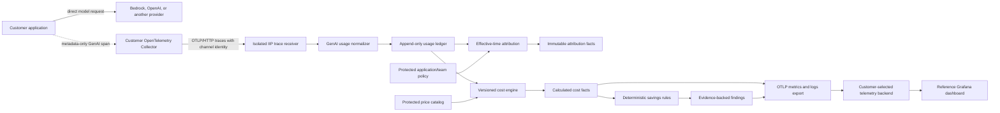

# AI economics architecture

**Status:** Accepted V0 boundary; deterministic local flow executable
**Date:** 2026-09-05

## Context

AI economics is a new knowledge flow inside IIP, not a provider-specific
subsystem. It reuses the existing isolated OTLP intake, tenant channel,
PostgreSQL durability, CloudEvents, evidence, export-health, SDK, and deployment
patterns. The receiver recognizes the standard OpenTelemetry provider
attribute plus the exact legacy alias emitted by the pinned Bedrock profile;
normalized records and cost calculation remain provider neutral.



The dashed edge is deliberately off the request path. The application does not
wait for IIP, the Collector, or Grafana.

## Boundary ownership

| Boundary | Responsibility |
| --- | --- |
| Upstream instrumentation | Produce standard GenAI span metadata and provider-reported usage when available. |
| Customer Collector | Batch, buffer, retry, authenticate, redact, and route telemetry according to customer policy. |
| Trace receiver surface | Authenticate the channel, bind tenant and integration, enforce bounds, decode OTLP, and reject content attributes. |
| Provider adapter | Translate accepted provider attributes into the canonical usage input without granting authority. |
| Application service | Enforce deduplication, usage invariants, tenant scope, protected effective-time attribution, pricing selection, and deterministic rule evaluation. |
| PostgreSQL adapter | Atomically persist immutable usage/attribution/cost/finding records and their outbox events. |
| OTLP exporter | Publish bounded aggregates and finding summaries without making serving readiness depend on delivery. |
| Grafana | Query a configured telemetry backend; it is not an accounting store or query authority. |

Provider SDKs and OTLP protobuf types remain in adapters and surfaces. Domain
objects contain only normalized provider, model, operation, region,
attribution, usage, and cost concepts.

## Usage fact

`AiUsageRecord` is one accepted model invocation. Tenancy comes from the
authenticated receiver channel, never from span attributes. The canonical
deduplication input includes tenant, channel, trace ID, span ID, provider,
operation, and request model. A retry of the same OTLP span therefore resolves
to the same record; a distinct model invocation remains distinct.

V0 accounting uses sampled metadata-only GenAI spans, not the
`gen_ai.client.token.usage` histogram, because a histogram cannot provide an
immutable per-invocation ledger. An accounting deployment must retain 100% of
eligible metadata spans before IIP intake. If the customer samples them, IIP
reports observed usage and does not extrapolate invoice cost.

Input and output totals may contain subsets:

```text
uncached input = inputTokens - cacheReadInputTokens - cacheWriteInputTokens
non-reasoning output = outputTokens - reasoningOutputTokens
```

Negative results are invalid. Missing breakdown values are zero only when the
source reports the parent total as complete; otherwise pricing is unresolved.

## Pricing and cost semantics

`AiPriceCatalog` is a protected, tenant-scoped snapshot. Entries match exact
provider, model, region, service tier, routing mode, purchase mode, and
effective time. Zero matches produce `unpriced`; multiple matches produce
`ambiguous`. Neither state produces a numeric zero.

Prices and amounts are integers. With `currencyScale: 9`, one currency unit is
one billion subunits. Each price is expressed in subunits per one million
tokens. A cost line uses a documented integer rounding rule; the V0 engine must
use half-up rounding and retain the source quantity, billable quantity, rate,
catalog entry, and resulting amount.

`AiCostRecord` always declares `calculated-estimate`. It is not AWS invoice
data, does not include discounts or commitments unless represented by an exact
catalog entry, and can be recomputed without altering the source usage record.
Future reconciliation with provider billing creates separate variance facts.

## Application and team attribution

The service identity on `AiUsageRecord` is observed telemetry, not permission
to charge an application or team. The workflow worker loads one protected,
tenant-scoped mapping snapshot and resolves each invocation at its `startedAt`
time. It creates a separate immutable `AiUsageAttributionRecord` bound to the
usage record, policy ID/version/source digest, and attribution-engine version.
The usage record is never rewritten.

Rules use deterministic unique priority and may narrow service identity by
namespace, deployment environment, resource reference, and effective interval.
No match becomes an explicit unallocated fact. Persistence re-resolves each
decision from the stored sources before atomically committing the fact, its
value-minimized CloudEvent, and outbox row. Only the tenant-enrolled worker has
that authority; neither telemetry nor an API caller can select ownership.

The bounded allocation query joins usage to exact attribution and cost
generations in the authoritative ledger. It accepts only an authenticated
tenant, a half-open interval of at most 31 days, and `application` or `team`;
it fails without partial totals above its source-row ceiling. The worker
projects the same report using protected stable IDs only, and the reference
dashboard exposes application/team cost beside unallocated and pricing
coverage. Historical display names remain in immutable API groups but never
become metric labels.

The executable cost service lives in the tenant-explicit workflow worker, not
the API or OTLP receiver. It reads one protected immutable catalog per enrolled
tenant, processes a bounded page, and uses the PostgreSQL adapter to commit the
cost record, cost-calculated CloudEvent, and outbox row atomically. Catalog ID
and version registration plus cost identity are concurrency-safe and
idempotent. A replacement catalog creates a new calculation lineage without
mutating prior facts.

## Finding semantics

`AiSavingsFinding` is the output of a versioned deterministic rule, not an AI
agent. It freezes current and baseline windows, attribution scope, observations,
potential-saving formula, supporting record references, and a validation-bound
recommendation. A rule emits no finding when its minimum cohort or pricing
requirements are not met.

The first rule is `context-growth`. Retry and expensive-model rules remain
disabled until their source facts and evaluation profiles have executable
coverage.

The executable rule runs only in the tenant-explicit workflow worker. A
protected profile fixes the exact provider, model, region, service,
environment, catalog, engine version, threshold, and two adjacent
equal-duration windows. V0 accepts only successful complete records with no
cache-read or cache-write input and exact priced costs. This conservative
subset prevents a calculated uncached-input saving from silently including
cached tokens.

For qualifying cohorts, the rule compares half-up-rounded mean input tokens
per request. It prices only the excess current-window input above the baseline
mean at the uniform current uncached-input rate. The finding cites every source
usage and cost record, freezes the arithmetic, carries a deterministic ID, and
requires validation before context retention changes. The PostgreSQL adapter
reloads and recalculates the complete cohort before atomically committing the
finding, value-minimized event, and outbox row. Pending, insufficient,
unpriced, unsupported, and below-threshold profiles create no finding.

After persistence, the same worker offers one bounded current-window aggregate
to the existing OTLP metrics runtime. It reports request/token volume, meter
and pricing coverage, calculated cost, baseline/current means, signed change,
rule status, and potential saving. Series dimensions come only from protected
profiles; invocation, trace, usage, cost, finding, evidence, and catalog
identities never become labels. More than the configured cohort maximum
suppresses the aggregate rather than presenting a truncated total. Recording
or export failure is isolated from ledger and rule outcomes.

The reference Compose topology routes independently authenticated Bedrock- and
OpenAI-shaped spans through an upstream Collector into the same isolated
receiver, exports the worker's bounded aggregates back through OTLP, and
renders them through Prometheus and one provisioned provider-neutral Grafana
dashboard. Loki is provisioned as the replaceable log destination but is not
an accounting authority. The time-relative fixture includes two protected
ownership mappings, priced and unpriced scopes, idempotent replay, and rejected
content spans for both channels. Pricing selection is solely catalog-driven;
the kernel contains no provider pricing branch. This proves the local contract
flow, not live provider instrumentation or invoice compatibility.

The exact pinned Python botocore `Converse` profile now has a separate
no-network interoperability gate. It exposed two upstream facts hidden by the
synthetic flow: the shipped scope is service-specific and the provider still
arrives as legacy `gen_ai.system`. The adapter normalizes that alias with
conflict rejection. Missing cache/reasoning subsets remain missing, so this
profile is not promoted to exact-cost eligibility. Live model/region and
`ConverseStream` qualification remain separate evidence.

The pinned official OpenAI Python chat-completions profile also has a separate
no-network SDK interoperability gate. It emits the standard provider identity
and input/output totals but not every cache-write and reasoning breakdown
needed by the exact cost engine. Those fields remain missing and the official
profile remains partial. The complete OpenAI-shaped pricing fixture is separate
synthetic evidence and cannot upgrade that upstream compatibility claim. Live
OpenAI, streaming, Responses API, and private-endpoint qualification remain
separate evidence.

## Privacy and security

- V0 allowlists required GenAI metadata and drops prompt, response, message,
  tool, embedding, retrieval-document, and raw provider payload attributes.
- The accepted usage contract fixes `contentCaptured` and
  `rawPayloadPersisted` to `false`.
- Trace IDs and span IDs support correlation; provider request IDs are hashed
  before persistence.
- High-cardinality values never become metric labels. Per-invocation identity
  remains in the ledger and bounded log/finding records.
- Receiver authorization, rate limits, payload limits, mTLS/SPIFFE identity,
  Bearer factor, CRL handling, and PostgreSQL-before-success semantics follow
  the existing isolated OTLP receiver boundary.
- Stored price catalogs are configuration data but remain tenant-bound and
  auditable because negotiated rates may be commercially sensitive.

## Failure behavior

Customer inference fails open with respect to observability. IIP intake fails
closed on identity, schema, content-policy, tenant, or usage violations. A
receiver outage relies on the customer's bounded persistent Collector queue;
once that queue is exhausted, telemetry loss is explicit in Collector
self-metrics. Optional IIP export failure never blocks ledger persistence or
API readiness.
