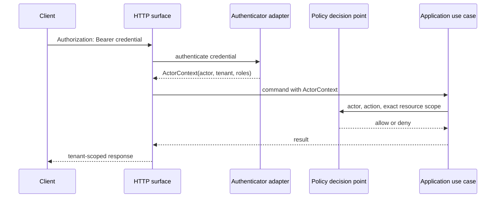

# Authentication boundary

**Status:** Accepted Phase 1 reference boundary
**Date:** 2026-08-14

The HTTP surface authenticates credentials before constructing the application `ActorContext`. Tenant, actor, and roles come from the configured authenticator; payload fields and request headers are consistency assertions at most and never grant identity.



## HTTP behavior

- `/healthz` and `/readyz` are public and reveal only process status.
- Every `/v1` operation requires exactly one syntactically valid Bearer credential.
- Missing credentials return HTTP 401 with `authentication.required`.
- Malformed, unknown, or rejected credentials return HTTP 401 with `authentication.invalid`.
- HTTP 401 responses carry `WWW-Authenticate: Bearer`.
- Authenticated requests still pass through the policy decision point and may return HTTP 403 with `policy.denied`.
- `x-iip-tenant-id` and `x-iip-actor-id` have no authority and are not emitted by SDKs.
- Credential values and authentication-adapter errors never enter responses, logs, resources, events, or evidence.

## Local verifier configuration

The reference adapter consumes a bounded JSON object through `IIP_AUTH_IDENTITIES_JSON`:

```json
{
  "identities": [
    {
      "tokenSha256": "sha256:<64 lowercase hexadecimal characters>",
      "actorId": "local-developer",
      "tenantId": "local",
      "roles": ["developer"]
    }
  ]
}
```

Only token verifiers are configured. Presented tokens must be high-entropy Bearer values of at least 32 characters. Duplicate verifiers, anonymous actors, malformed identifiers, unknown properties, and unbounded configurations fail startup. Verifier configuration must still be protected as secret material because it can be used for offline token guessing.

This adapter has no issuance, expiry, rotation, revocation, federation, or identity-provider discovery. It is suitable for local execution and contract tests only. [ADR 0005](../decisions/0005-credential-derived-request-identity.md) keeps the production identity-provider choice open behind the same port.
