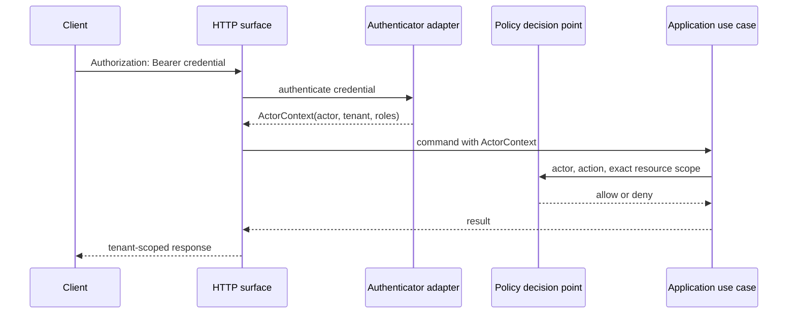

# Authentication boundary

**Status:** Accepted local and production-facing boundary
**Date:** 2026-08-14

The HTTP surface authenticates credentials before constructing the application `ActorContext`. Tenant, actor, and roles come from the configured authenticator; payload fields and request headers are consistency assertions at most and never grant identity.

An authenticated client may call `GET /v1/session` to retrieve its non-secret `SessionContext`. This enables browser and SDK workflows to populate required identity assertions from server-derived context. The response does not replace authorization at a use-case port and cannot be used to select or elevate an identity.



## HTTP behavior

- `/healthz` and `/readyz` are public and reveal only process liveness or a generic dependency-readiness result; no identity, tenant, endpoint, schema, or provider detail is returned.
- Every `/v1` operation requires exactly one syntactically valid Bearer credential.
- Missing credentials return HTTP 401 with `authentication.required`.
- Malformed, unknown, or rejected credentials return HTTP 401 with `authentication.invalid`.
- HTTP 401 responses carry `WWW-Authenticate: Bearer`.
- Authenticated requests still pass through the policy decision point and may return HTTP 403 with `policy.denied`.
- `x-iip-tenant-id` and `x-iip-actor-id` have no authority and are not emitted by SDKs.
- Credential values and authentication-adapter errors never enter responses, logs, resources, events, or evidence.

## Local verifier configuration

The reference adapter consumes a bounded JSON object through `IIP_AUTH_IDENTITIES_JSON`:

```json
{
  "identities": [
    {
      "tokenSha256": "sha256:<64 lowercase hexadecimal characters>",
      "actorId": "local-developer",
      "tenantId": "local",
      "roles": ["developer"]
    }
  ]
}
```

Only token verifiers are configured. Presented tokens must be high-entropy Bearer values of at least 32 characters. Duplicate verifiers, anonymous actors, malformed identifiers, unknown properties, and unbounded configurations fail startup. Verifier configuration must still be protected as secret material because it can be used for offline token guessing.

This adapter has no issuance, expiry, rotation, revocation, federation, or identity-provider discovery. It is suitable for local execution and contract tests only.

## OIDC/JWKS deployment mode

`IIP_AUTH_MODE=oidc` selects the production-facing verifier described by
[ADR 0037](../decisions/0037-oidc-and-external-policy-boundaries.md). The bounded
`IIP_AUTH_OIDC_CONFIG_JSON` object declares an HTTPS issuer, audience, HTTPS JWKS
URL, and the exact tenant and roles claim names. Optional settings select a
subject-derived actor claim, protected CA bundle, bounded cache lifetime, and
clock skew.

```json
{
  "issuer": "https://identity.example.com/",
  "audience": "iip-control-plane",
  "jwksUrl": "https://identity.example.com/.well-known/jwks.json",
  "actorClaim": "sub",
  "tenantClaim": "iip_tenant_id",
  "rolesClaim": "iip_roles",
  "caBundlePath": "/var/run/iip-oidc-ca/ca.crt",
  "cacheSeconds": 300,
  "clockSkewSeconds": 30
}
```

Only RS256 is accepted. The verifier requires issuer, audience, subject,
expiration, issued-at, configured tenant, and configured roles claims. It rejects
algorithm indirection headers, validates actor/tenant/role syntax after signature
verification, caches at most 64 keys, and refreshes once when a key ID rotates.
JWKS reads are TLS-only, bounded, and redirect-free. Every rejection remains the
same `authentication.invalid` response.

The platform does not issue OIDC tokens. Customer issuer enrollment, claim
mapping governance, MFA/session policy, revocation behavior, and workload
identity configuration stay with the deployment's identity provider.
