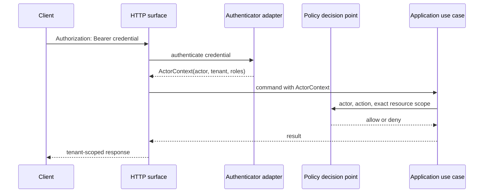

# Authentication boundary

**Status:** Accepted local and production-facing boundary
**Date:** 2026-08-14

The HTTP surface authenticates credentials before constructing the application `ActorContext`. Tenant, actor, and roles come from the configured authenticator; payload fields and request headers are consistency assertions at most and never grant identity.

Before authentication, a browser or SDK may call `GET /v1/authentication/console` to retrieve the deployment's non-secret console mode. An authenticated client may call `GET /v1/session` to retrieve its non-secret `SessionContext`. Together these endpoints let the browser discover how to obtain a credential and then populate identity assertions from server-derived context. Neither response can select or elevate an identity, and neither replaces authorization at a use-case port.



## HTTP behavior

- Control-plane `/healthz` and `/readyz` are public and reveal only process liveness or a generic dependency-readiness result; no identity, tenant, endpoint, schema, or provider detail is returned.
- The workflow worker exposes the same minimized paths only on an unserved pod-local health port. It has no public Service or `/v1` routes, and readiness carries no authentication or tenant authority.
- `GET /v1/authentication/console` is the only public `/v1` exception. It returns a closed non-secret discovery document, accepts no query parameters, and is never tenant-specific.
- Every other `/v1` operation requires exactly one syntactically valid Bearer credential.
- Missing credentials return HTTP 401 with `authentication.required`.
- Malformed, unknown, or rejected credentials return HTTP 401 with `authentication.invalid`.
- HTTP 401 responses carry `WWW-Authenticate: Bearer`.
- Authenticated requests still pass through the policy decision point and may return HTTP 403 with `policy.denied`.
- `x-iip-tenant-id` and `x-iip-actor-id` have no authority and are not emitted by SDKs.
- Credential values and authentication-adapter errors never enter responses, logs, resources, events, or evidence.

## Local verifier configuration

The reference adapter consumes a bounded JSON object through `IIP_AUTH_IDENTITIES_JSON`:

```json
{
  "identities": [
    {
      "tokenSha256": "sha256:<64 lowercase hexadecimal characters>",
      "actorId": "local-developer",
      "tenantId": "local",
      "roles": ["developer"]
    }
  ]
}
```

Only token verifiers are configured. Presented tokens must be high-entropy Bearer values of at least 32 characters. Duplicate verifiers, anonymous actors, malformed identifiers, unknown properties, and unbounded configurations fail startup. Verifier configuration must still be protected as secret material because it can be used for offline token guessing.

This adapter has no issuance, expiry, rotation, revocation, federation, or identity-provider discovery. It is suitable for local execution and contract tests only.

## OIDC/JWKS deployment mode

`IIP_AUTH_MODE=oidc` selects the production-facing verifier described by
[ADR 0037](../decisions/0037-oidc-and-external-policy-boundaries.md). The bounded
`IIP_AUTH_OIDC_CONFIG_JSON` object declares an HTTPS issuer, audience, HTTPS JWKS
URL, and the exact tenant and roles claim names. Optional settings select a
subject-derived actor claim, protected CA bundle, bounded cache lifetime, and
clock skew.

```json
{
  "issuer": "https://identity.example.com/",
  "audience": "iip-control-plane",
  "jwksUrl": "https://identity.example.com/.well-known/jwks.json",
  "actorClaim": "sub",
  "tenantClaim": "iip_tenant_id",
  "rolesClaim": "iip_roles",
  "browser": {
    "clientId": "iip-console",
    "authorizationEndpoint": "https://identity.example.com/oauth2/authorize",
    "tokenEndpoint": "https://identity.example.com/oauth2/token",
    "redirectUri": "https://iip.example.com/console",
    "scopes": ["openid", "profile"],
    "providerLabel": "Organization SSO"
  },
  "caBundlePath": "/var/run/iip-oidc-ca/ca.crt",
  "cacheSeconds": 300,
  "clockSkewSeconds": 30
}
```

Only RS256 is accepted. The verifier requires issuer, audience, subject,
expiration, issued-at, configured tenant, and configured roles claims. It rejects
algorithm indirection headers, validates actor/tenant/role syntax after signature
verification, caches at most 64 keys, and refreshes once when a key ID rotates.
JWKS reads are TLS-only, bounded, and redirect-free. Every rejection remains the
same `authentication.invalid` response.

The optional `browser` object enables the customer console's Authorization Code
flow with a fresh `S256` PKCE challenge and state value. It is a public-client
profile: client secrets are prohibited, the exact redirect is HTTPS except for
loopback testing, and authorization/token endpoints are HTTPS, query-free, and
redirect-free. The public discovery document omits the audience, JWKS URL,
claim mappings, CA path, and all credential material. The console exchanges the
code directly with the identity provider, stores no refresh or ID token, and
then proves the access token through the same `/v1/session` verifier used by
every API call. [ADR 0063](../decisions/0063-console-oidc-authorization-code-pkce.md)
records the accepted browser boundary.

The local real-TLS profile in [ADR 0078](../decisions/0078-executable-oidc-issuer-compatibility-evidence.md) proves the shipped transport and verifier across CA trust, redirect denial, exact claims, cache/refresh behavior, key rotation/removal, expired-cache outage, recovery, and minimized PKCE discovery. The separate browser profile in [ADR 0116](../decisions/0116-executable-oidc-browser-pkce-evidence.md) drives an exact authorization redirect and direct `S256` token exchange, proves origin/CORS and one-time-code behavior, then verifies the returned token through the same authenticator. Both are source-bound release evidence against disposable fixtures, not customer identity-provider qualification.

The platform does not issue OIDC tokens or hold an OAuth client secret. Customer issuer enrollment, exact redirect registration, token-endpoint CORS, claim mapping governance, MFA/session/logout policy, revocation behavior, and workload identity configuration stay with the deployment's identity provider. Follow the [OIDC qualification runbook](../operations/oidc-identity.md) before rollout.
