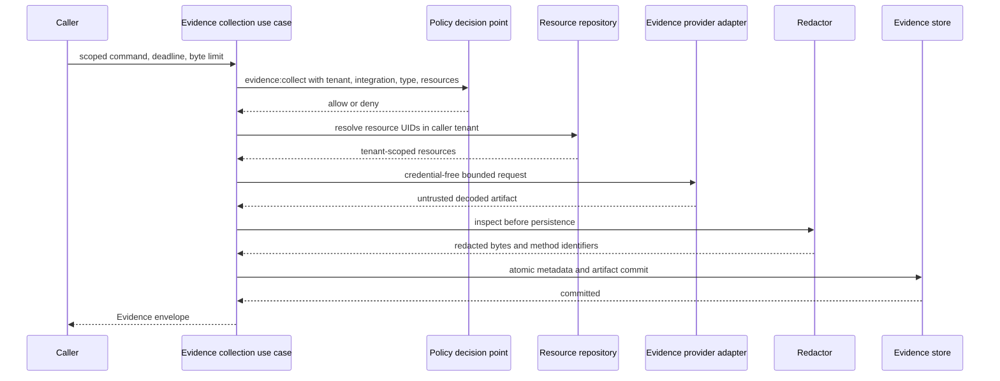

# Evidence collection pipeline

**Status:** Accepted Phase 2 reference boundary
**Date:** 2026-08-14

The reference kernel implements the boundary that turns untrusted pulled provider output or a normalized pushed artifact into an immutable Evidence envelope and artifact. The same policy, resource resolution, redaction, hashing, and atomic storage semantics apply to both entry paths.

## Trust and execution sequence

Authorization and complete resource resolution occur before provider execution. A provider receives the authenticated tenant and actor identity, integration identifier, evidence type, resource UIDs, credential-free locator/query, deadline, and maximum decoded byte count. It does not receive ambient credentials through the application contract. Live adapters resolve short-lived access internally from an explicitly configured integration through the shared broker port.

The `record_artifact` path is for authenticated push adapters that already hold a bounded decoded artifact, not a way to bypass Evidence controls. The OTLP receiver authenticates and bounds its channel before reading/decoding the body, then passes normalized JSON through this path. Evidence policy and tenant-scoped resource resolution still run before redaction or persistence, and no receiver payload field supplies authority.

Provider results remain untrusted. The application validates result type, media type, timestamps, summary safety, and size; then the redactor inspects decoded bytes. Hashing and persistence use the redacted bytes, never the original provider bytes. The store port commits the Evidence metadata and artifact together so a record cannot reference a missing artifact.

## Ports and ownership

The application layer owns these provider-neutral ports:

- `EvidenceProvider` retrieves one artifact within a request scope;
- `EvidenceRedactor` returns inspected bytes and stable redaction method identifiers;
- `EvidenceStore` atomically commits immutable metadata and decoded bytes and requires explicit actor and tenant scope on every operation;
- `EvidenceIdGenerator` creates opaque identifiers independent of content; and
- `Clock` makes deadline and provenance behavior deterministic in tests.

Metric evidence adds `TelemetryMetricsBackend`, whose request contains only normalized selectors, authenticated scope, and explicit limits. `TelemetryMetricsEvidenceProvider` validates all backend output and renders the public `TelemetryEvidenceResult` JSON before the generic evidence pipeline redacts, hashes, and commits it. A concrete backend never controls Evidence identity, tenant scope, policy, retention, or content hashes. The first concrete adapter translates an allowlisted logical metric catalog to Prometheus range queries. Its optional `CredentialBroker` lease is exact-scope and remains inside the adapter. The shared external broker client exchanges that scope over verified HTTPS using explicitly projected workload identity; broker leases never enter the Evidence pipeline.

Kubernetes Event evidence follows the same shape through a separate `KubernetesEventsBackend`. The application resolves tenant-scoped resource UIDs to bounded Kubernetes external identities, while the adapter owns API transport and protected credential resolution. The live adapter reads each exact current Kubernetes object, binds Event lookup to its provider UID, and uses only bounded HTTPS `GET` requests under configured namespace/resource allowlists. The provider rejects records outside the requested resource, severity, reason, time, count, and byte bounds, maps them to stable condition taxonomy keys, orders them canonically, and emits `KubernetesEventEvidenceResult`. Customer cluster Events remain distinct from internal CloudEvents.

The investigator may select root-cause-scoped `kubernetesEventSelections` before telemetry selection. It assesses only committed artifact bytes, counts declared normalized conditions, and records matched event IDs. No-data and partial results remain explicit; supporting and contradicting results cite the hypothesis without changing its resource-derived class or confidence.

The deterministic investigator can select ordered `telemetrySelections` after classifying current resource state. Each candidate inherits authenticated actor/tenant, resource scope, time range, and deadline from its investigation and is executed through `TelemetryEvidenceService`. Candidate matching and every attempted query remain inside the investigation tool/evidence budgets; replay of a committed investigation does not query a backend again.

When a root-cause-scoped candidate declares a threshold rule, assessment occurs only after immutable commit. The investigator retrieves the artifact through `EvidenceStore.read_artifact(actor, evidence_id)`, validates the normalized envelope, selected metric, exact unit, completeness, and finite points, then records the applied rule in the report. It never interprets the adapter's untrusted raw response. No-data and partial results cannot become hypothesis support.

A candidate may instead declare baseline and evaluation windows inside the same investigation range: absolute two-window timestamps, bounded rolling durations anchored at the accepted scope end, or fixed-period seasonal lookbacks. The runtime records all derived absolute windows, splits only the points read from that one committed artifact, applies the declared statistic to each complete window, and evaluates a difference or ratio. Seasonal rules require every period and aggregate their nearest-first values by mean or median. This preserves query/evidence budgets and backend portability. Missing window data and a zero ratio denominator fail closed to `incomplete`; the runtime does not interpolate or issue an implicit second query. [ADR 0032](../decisions/0032-scope-end-rolling-baseline.md) fixes rolling derivation and [ADR 0076](../decisions/0076-deterministic-seasonal-telemetry-baseline.md) fixes periodic derivation.

Pushed metrics add a separate `OtlpMetricsReceiverAdapter` port. Protected channel configuration supplies tenant, integration, resources, catalogs, limits, and handling policy; the application validates normalized `OtlpMetricsEvidence` before the generic pipeline commits it. Protobuf types and channel verifiers remain in the adapter/surface boundary.

Historical log queries and pushed OTLP logs follow the same ownership pattern through separate `TelemetryLogsBackend` and `OtlpLogsReceiverAdapter` ports. The first live query adapter translates closed logical selectors into Loki label selectors using tenant-bound protected configuration and exact `logs:read` credential leases; no public caller supplies LogQL, provider labels, organization headers, or endpoints. Log query results and normalized push batches are bounded and scope-checked before entering this pipeline. Bodies are confidential untrusted text and always pass structured redaction before hashing and persistence.

Resource-change evidence uses the same pipeline with the tenant-scoped immutable observation repository as its source. The provider scans a declared maximum per resource, ignores stale/conflicting observations, classifies accepted before/after state by changed JSON Pointer paths, and stores hashes and cursor provenance without copying changed values. Observation or result truncation is explicit partial evidence. [ADR 0026](../decisions/0026-resource-history-change-evidence.md) records the completeness and minimization rules.

The investigator may select root-cause-scoped resource changes after Kubernetes Events and before external telemetry. It derives identity, resources, time, deadline, and budgets from the investigation, then assesses only the committed artifact. Complete results apply a predeclared change-count rule and expose only stable IDs and counts in the report. No-data stays explicit; partial, corrupt, missing, or mismatched results cannot become citations. [ADR 0027](../decisions/0027-investigation-change-correlation.md) records this correlation boundary.

Repository and runbook context uses a separate `ContextDocumentsBackend`.
Public callers select logical allowlisted references and closed kinds, never
paths, repository queries, endpoints, or credentials. The file adapter confines
reads to a protected root. The GitHub adapter maps those same logical
references through protected tenant configuration to one repository path at an
exact commit, obtains an exact `repository:contents:read` broker lease, and
validates the returned path, size, Base64 UTF-8 content, and Git blob identity
over direct verified HTTPS. Both feed the same provider that redacts every
excerpt before constructing the normalized result. All context documents are
explicitly untrusted data and cannot carry instruction or authority semantics.
[ADR 0028](../decisions/0028-untrusted-context-evidence.md) fixes the trust
boundary; [ADR 0106](../decisions/0106-protected-github-repository-context-adapter.md)
fixes the first remote adapter and its compatibility evidence.

The investigator may select root-cause-scoped context through the same public query/limit fragment. It inherits authenticated scope and budgets, then re-reads and structurally validates only the committed artifact. Complete results apply a predeclared document-count rule and expose only stable document IDs and logical references in the report; excerpts never leave the protected Evidence artifact or become instructions. No-data, partial, corrupt, missing, or scope-mismatched results remain explicit gaps and cannot become citations. [ADR 0029](../decisions/0029-investigation-context-correlation.md) records this correlation boundary.

The investigator may select root-cause-scoped historical log queries after Kubernetes Event and metric selections. It derives identity, scope, and deadline from the investigation, executes through `LogEvidenceService`, and assesses only the committed artifact. The first rule counts normalized records against a predeclared minimum; it never interprets log body prose. Complete supporting or contradicting results cite the hypothesis, while no-data, partial, corrupt, and mismatched artifacts remain explicit gaps.

The local adapter package supplies an in-memory evidence store, UUID identifier generator, UTC system clock, deterministic static provider, and structured-text redactor. JSON secret-bearing fields and common credential patterns are redacted. UTF-8 text receives pattern redaction. Unsupported binary formats fail closed instead of being persisted without inspection.

Artifact retention is a separate application port and never changes Evidence collection authority. The observe use case counts present, eligible, and legal-hold artifact bodies for one exact tenant. The worker's fixed system actor may expire only a bounded eligible batch after policy approval. PostgreSQL commits byte deletion and one aggregate audit record under a tenant-keyed transaction lock; the Evidence document, hash, storage reference, and citations remain immutable. Automatic cleanup is disabled unless deployment configuration explicitly enables it. [ADR 0062](../decisions/0062-audited-evidence-artifact-retention.md) records this lifecycle boundary.

## Security and failure behavior

- The policy input includes tenant, provider, integration, evidence type, and the exact resource UID tuple.
- Resource lookup uses the actor tenant and returns one generic unavailable error for missing or cross-tenant references.
- Locators, queries, and summaries reject common credential patterns, URI user information, and signed-token query parameters.
- Provider exceptions are replaced by `evidence.provider.unavailable`; provider exception text is not exposed.
- Deadline checks occur before provider execution, after retrieval, and before commit.
- Redaction failures and unsupported media types prevent all persistence.
- `contentHash` is SHA-256 over the stored decoded bytes, and `sizeBytes` is their exact length.
- Evidence IDs and logical storage references contain no source content.

The reference byte limit is 16 MiB even though the public contract permits a larger storage-level maximum. Providers can receive smaller per-request limits.

## Current limits

The local store remains process-local, while the PostgreSQL profile durably stores evidence metadata and artifact bytes and is covered by the full-schema backup/restore experiment. Authenticated HTTP and SDK boundaries expose tenant-scoped evidence metadata retrieval and bounded metric, log, Kubernetes Event, resource-change, and repository/runbook context evidence collection; artifact bytes remain internal.

This is not yet a production evidence service. The bounded retention worker preserves metadata while expiring database artifact bodies, but there is no encryption/KMS integration, sensitivity-specific artifact-read surface, artifact streaming, external object lifecycle, or physical-compaction policy. The Prometheus-compatible and Loki adapters, live read-only Kubernetes Event API adapter, external credential-broker client and local real-TLS compatibility profile, static development brokers, isolated tenant-bound OTLP metrics/logs receivers with CA-verified SPIFFE mTLS and a persistent customer-Collector queue profile, honest no-data defaults, deterministic investigation selection, closed condition/change-count/threshold/log-count assessment, and explicit, rolling, or fixed-period seasonal baseline comparison prove translation and exact request scoping but are not a production credential issuer, federated identity plane, telemetry store, calendar-aware or learned baseline engine, or general multi-signal reasoning solution. The redactor is a conservative reference for JSON and UTF-8 text, not a general data-loss-prevention system. Additional media inspectors, customer issuer/broker/PKI interoperability qualification, measured queue loss objectives, additional customer backends, and broader multi-signal reasoning remain Phase 2 work.
