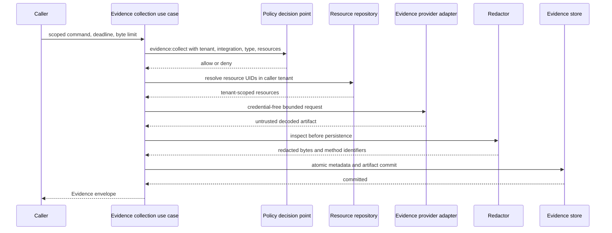

# Evidence collection pipeline

**Status:** Accepted Phase 2 reference boundary
**Date:** 2026-08-14

The reference kernel implements the boundary that turns untrusted pulled provider output or a normalized pushed artifact into an immutable Evidence envelope and artifact. The same policy, resource resolution, redaction, hashing, and atomic storage semantics apply to both entry paths.

## Trust and execution sequence

Authorization and complete resource resolution occur before provider execution. A provider receives the authenticated tenant and actor identity, integration identifier, evidence type, resource UIDs, credential-free locator/query, deadline, and maximum decoded byte count. It does not receive ambient credentials through the application contract. A production adapter will resolve short-lived access internally from an explicitly configured integration.

The `record_artifact` path is for authenticated push adapters that already hold a bounded decoded artifact, not a way to bypass Evidence controls. The OTLP receiver authenticates and bounds its channel before reading/decoding the body, then passes normalized JSON through this path. Evidence policy and tenant-scoped resource resolution still run before redaction or persistence, and no receiver payload field supplies authority.

Provider results remain untrusted. The application validates result type, media type, timestamps, summary safety, and size; then the redactor inspects decoded bytes. Hashing and persistence use the redacted bytes, never the original provider bytes. The store port commits the Evidence metadata and artifact together so a record cannot reference a missing artifact.

## Ports and ownership

The application layer owns these provider-neutral ports:

- `EvidenceProvider` retrieves one artifact within a request scope;
- `EvidenceRedactor` returns inspected bytes and stable redaction method identifiers;
- `EvidenceStore` atomically commits immutable metadata and decoded bytes and requires explicit actor and tenant scope on every operation;
- `EvidenceIdGenerator` creates opaque identifiers independent of content; and
- `Clock` makes deadline and provenance behavior deterministic in tests.

Metric evidence adds `TelemetryMetricsBackend`, whose request contains only normalized selectors, authenticated scope, and explicit limits. `TelemetryMetricsEvidenceProvider` validates all backend output and renders the public `TelemetryEvidenceResult` JSON before the generic evidence pipeline redacts, hashes, and commits it. A concrete backend never controls Evidence identity, tenant scope, policy, retention, or content hashes. The first concrete adapter translates an allowlisted logical metric catalog to Prometheus range queries. Its optional `CredentialBroker` lease is exact-scope and remains inside the adapter.

The deterministic investigator can select ordered `telemetrySelections` after classifying current resource state. Each candidate inherits authenticated actor/tenant, resource scope, time range, and deadline from its investigation and is executed through `TelemetryEvidenceService`. Candidate matching and every attempted query remain inside the investigation tool/evidence budgets; replay of a committed investigation does not query a backend again.

When a root-cause-scoped candidate declares a threshold rule, assessment occurs only after immutable commit. The investigator retrieves the artifact through `EvidenceStore.read_artifact(actor, evidence_id)`, validates the normalized envelope, selected metric, exact unit, completeness, and finite points, then records the applied rule in the report. It never interprets the adapter's untrusted raw response. No-data and partial results cannot become hypothesis support.

Pushed metrics add a separate `OtlpMetricsReceiverAdapter` port. Protected channel configuration supplies tenant, integration, resources, catalogs, limits, and handling policy; the application validates normalized `OtlpMetricsEvidence` before the generic pipeline commits it. Protobuf types and channel verifiers remain in the adapter/surface boundary.

The local adapter package supplies an in-memory evidence store, UUID identifier generator, UTC system clock, deterministic static provider, and structured-text redactor. JSON secret-bearing fields and common credential patterns are redacted. UTF-8 text receives pattern redaction. Unsupported binary formats fail closed instead of being persisted without inspection.

## Security and failure behavior

- The policy input includes tenant, provider, integration, evidence type, and the exact resource UID tuple.
- Resource lookup uses the actor tenant and returns one generic unavailable error for missing or cross-tenant references.
- Locators, queries, and summaries reject common credential patterns, URI user information, and signed-token query parameters.
- Provider exceptions are replaced by `evidence.provider.unavailable`; provider exception text is not exposed.
- Deadline checks occur before provider execution, after retrieval, and before commit.
- Redaction failures and unsupported media types prevent all persistence.
- `contentHash` is SHA-256 over the stored decoded bytes, and `sizeBytes` is their exact length.
- Evidence IDs and logical storage references contain no source content.

The reference byte limit is 16 MiB even though the public contract permits a larger storage-level maximum. Providers can receive smaller per-request limits.

## Current limits

The local store remains process-local, while the PostgreSQL profile durably stores evidence metadata and artifact bytes and is covered by the full-schema backup/restore experiment. Authenticated HTTP and SDK boundaries expose tenant-scoped evidence metadata retrieval and bounded metric-evidence collection; artifact bytes remain internal.

This is not yet a production evidence service. There is no retention worker, encryption/KMS integration, sensitivity-specific artifact-read surface, artifact streaming, or external short-lived credential broker. The Prometheus-compatible adapter, static protected-config bearer broker, tenant-bound OTLP metrics receiver, deterministic investigation selection, and closed threshold assessment prove translation and exact request scoping but are not production identity, isolation, telemetry-storage, or general metric-reasoning solutions. The redactor is a conservative reference for JSON and UTF-8 text, not a general data-loss-prevention system. Additional media inspectors, backends/signals, receiver isolation/workload identity, baselines, and multi-signal reasoning remain Phase 2 work.
