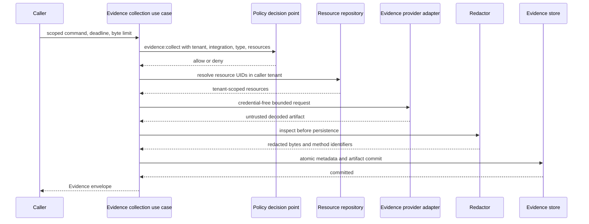

# Evidence collection pipeline

**Status:** Accepted Phase 1 reference boundary
**Date:** 2026-08-14

The reference kernel implements the boundary that turns untrusted provider output into an immutable Evidence envelope and artifact. It establishes application ports and security ordering before durable evidence storage or an HTTP surface is introduced.

## Trust and execution sequence

Authorization and complete resource resolution occur before provider execution. A provider receives the authenticated tenant and actor identity, integration identifier, evidence type, resource UIDs, credential-free locator/query, deadline, and maximum decoded byte count. It does not receive ambient credentials through the application contract. A production adapter will resolve short-lived access internally from an explicitly configured integration.

Provider results remain untrusted. The application validates result type, media type, timestamps, summary safety, and size; then the redactor inspects decoded bytes. Hashing and persistence use the redacted bytes, never the original provider bytes. The store port commits the Evidence metadata and artifact together so a record cannot reference a missing artifact.

## Ports and ownership

The application layer owns these provider-neutral ports:

- `EvidenceProvider` retrieves one artifact within a request scope;
- `EvidenceRedactor` returns inspected bytes and stable redaction method identifiers;
- `EvidenceStore` atomically commits immutable metadata and decoded bytes and requires explicit actor and tenant scope on every operation;
- `EvidenceIdGenerator` creates opaque identifiers independent of content; and
- `Clock` makes deadline and provenance behavior deterministic in tests.

The local adapter package supplies an in-memory evidence store, UUID identifier generator, UTC system clock, deterministic static provider, and structured-text redactor. JSON secret-bearing fields and common credential patterns are redacted. UTF-8 text receives pattern redaction. Unsupported binary formats fail closed instead of being persisted without inspection.

## Security and failure behavior

- The policy input includes tenant, provider, integration, evidence type, and the exact resource UID tuple.
- Resource lookup uses the actor tenant and returns one generic unavailable error for missing or cross-tenant references.
- Locators, queries, and summaries reject common credential patterns, URI user information, and signed-token query parameters.
- Provider exceptions are replaced by `evidence.provider.unavailable`; provider exception text is not exposed.
- Deadline checks occur before provider execution, after retrieval, and before commit.
- Redaction failures and unsupported media types prevent all persistence.
- `contentHash` is SHA-256 over the stored decoded bytes, and `sizeBytes` is their exact length.
- Evidence IDs and logical storage references contain no source content.

The reference byte limit is 16 MiB even though the public contract permits a larger storage-level maximum. Providers can receive smaller per-request limits.

## Deliberate Phase 1 limits

This slice is not yet a production evidence service. The default store is process-local and has no retention worker, encryption integration, sensitivity-aware read use case, PostgreSQL implementation, backup path, or artifact streaming. The redactor is a conservative reference for JSON and UTF-8 text, not a general data-loss-prevention system. There is no evidence endpoint in OpenAPI and no SDK operation in this unit; adding one requires authenticated tenant/actor middleware and an authorization-checked read or collection surface.

Durable storage, request-scoped credential brokering, additional media inspectors, and investigation-driven provider orchestration remain Phase 2 work.
