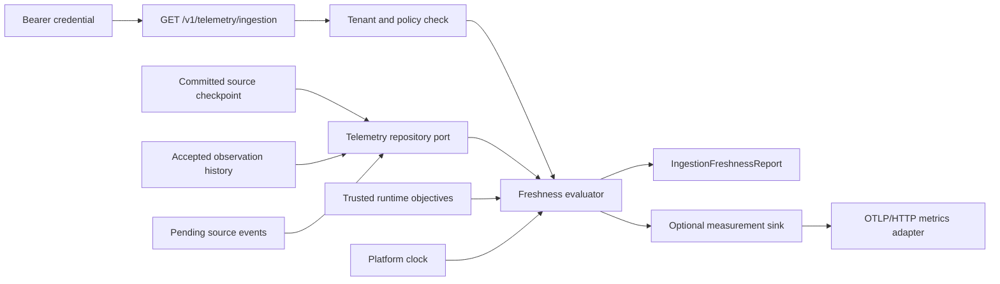

# Ingestion freshness telemetry

**Status:** Phase 1 reference implementation
**Date:** 2026-08-15
**Decision:** [ADR 0011](../decisions/0011-ingestion-freshness-semantics.md)

This boundary answers one operational question: for a tenant and configured source, is the latest completely committed collection and its downstream event delivery still within the platform's current objectives? It reads existing authoritative records; it does not create a second telemetry database or accept provider claims about health.

## Flow and ownership

The application owns `SourceIngestionTelemetryRepository` and the calculation. The in-memory and PostgreSQL adapters return raw tenant/source facts. The HTTP surface authenticates, parses one `sourceId`, and maps stable errors. SDKs consume only the public report contract.

## Signals

| Signal | Source | Meaning |
| --- | --- | --- |
| Checkpoint age | Last complete committed source checkpoint | Primary collection freshness, including empty reconciliations |
| Observation age | Latest accepted provider observation time | Age of the newest accepted source fact |
| Ingestion delay | Latest observation time to platform recording time | Delay before the source fact became durable |
| Pending event count and oldest age | Transactional outbox joined to the source event | Downstream delivery backlog |
| Clock-skew violation | Provider/storage timestamp compared with platform time | Prevents future timestamps from appearing healthy |

Partial, failed, cancelled, stale-resume, and scope-conflicting collection results do not advance the checkpoint, so they cannot reset freshness. The result never includes opaque provider cursors, checkpoints, resource documents, credential references, or provider exception text.

## Tenancy and failure behavior

Authentication derives the actor and tenant before query parsing reaches storage. Policy authorizes `ingestion-telemetry:read`, and the repository query requires both tenant and source predicates. A missing source returns the same `ingestion.source_not_found` code whether the source does not exist or exists only in another tenant.

Adapter inconsistency and storage failures fail closed as `storage.unavailable`. Objective values are constructed only in `bootstrap.py`; requests cannot override them. Negative durations are clamped to zero, and timestamps beyond the allowed skew produce a violation rather than a misleading negative measurement.

## Export portability

The report is the authoritative product result, not an observability-backend read model. After a successful evaluation, the application offers the same rounded, bounded values to `IngestionTelemetrySink`. The OpenTelemetry adapter records local synchronous instruments and the official SDK exports them asynchronously over OTLP/HTTP. Recording and export failures cannot change the returned report or roll back platform work.

Export is disabled unless `IIP_OTEL_METRICS_ENABLED=true`. A customer-controlled Collector can route the metrics to a different backend without changing freshness semantics or application code. Attribute policy independently controls whether no resource identity, source ID, or tenant plus source IDs accompany the metrics. See the [OpenTelemetry portability boundary](opentelemetry-portability.md) and [operations guide](../operations/opentelemetry-export.md).

## Current limit

The report is a point-in-time Phase 1 SLI with local objectives. It proves that source lag is measurable at the API boundary. Metrics are emitted only when a caller evaluates freshness; there is no background sampler yet. Aggregated time windows, automatic sampling, production SLO/error-budget policy, alert routing, and exporter-delivery health remain Phase 3 work.
