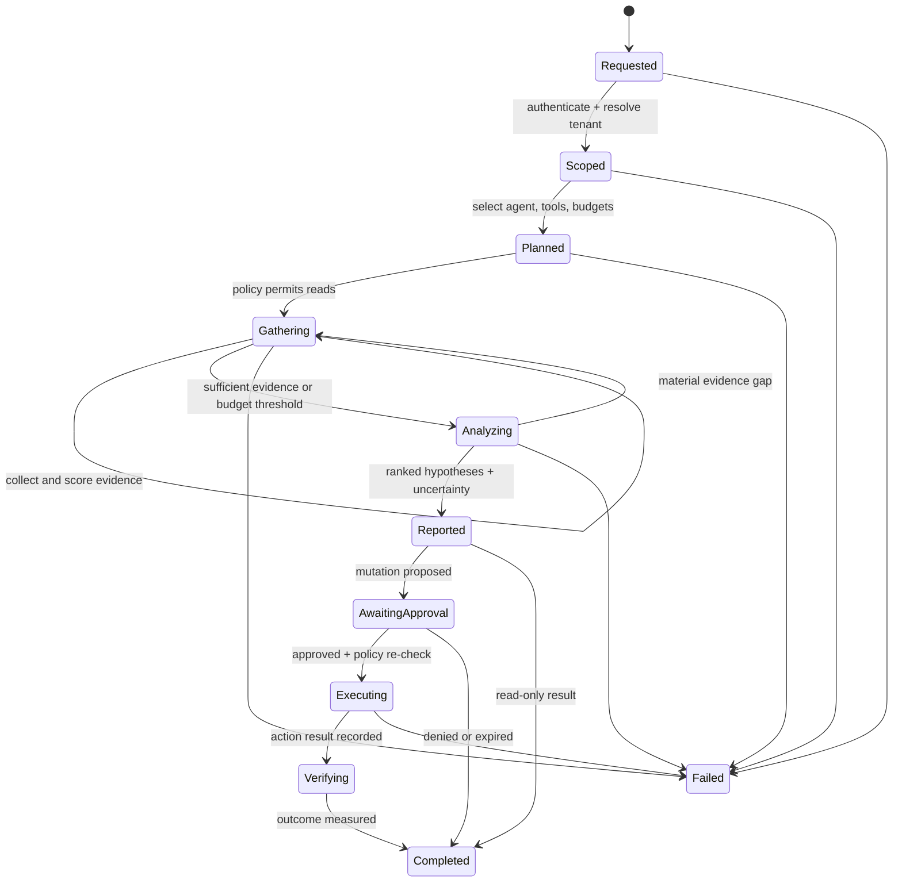

# Investigation lifecycle

**Status:** Draft contract direction  
**Date:** 2026-08-14

An investigation is a durable, bounded state machine. Model reasoning is one step inside it, not the workflow owner.

## Required state

- investigation ID, tenant, actor, trigger, correlation ID;
- explicit resource and time scopes;
- selected agent/version and model class;
- allowed tools and resolved request-scoped credentials;
- wall-time, call, token, and cost budgets;
- hypotheses with supporting and contradicting evidence;
- tool-call ledger including inputs, normalized outputs, duration, and failure code;
- recommendations and proposed actions;
- policy decisions, approvals, execution attempts, verification, and terminal reason.

## Loop controls

The gathering loop must enforce a relevant-tool cap, duplicate-call cache, context budget, maximum iterations, wall-clock deadline, cost ceiling, and stagnation breaker. A conclusion may be `inconclusive`; the runtime must never manufacture certainty to satisfy a workflow.

## Evidence quality

Evidence records include origin, observation time, retrieval time, resource references, query or locator, redaction state, content hash, and a short normalized summary. Agent-produced summaries do not replace the immutable source artifact. Contradicting evidence remains visible.

Metric query candidates are declared as request upper bounds and selected only after resource classification. The runtime derives their authenticated identity, resources, time range, and deadline from the investigation, then executes them through the shared telemetry Evidence boundary. Candidate attempts consume investigation budgets, and a committed investigation replay never repeats them.

A candidate may carry a closed threshold rule tied to its root-cause classes. After Evidence commit, the runtime reads the normalized artifact back through the actor-scoped store, checks metric and unit, and records an auditable assessment. Supporting and contradicting outcomes become hypothesis citations; neutral, no-data, and incomplete outcomes stay visible. This deterministic step never rewrites the classifier's root-cause class or confidence.

A candidate may instead compare an earlier baseline window with a later evaluation window. Both are non-overlapping subranges of the inherited investigation scope and are evaluated from the same committed metric artifact, so the comparison adds no backend call or Evidence item. Missing window data, partial output, and a zero ratio denominator remain explicit incomplete assessments.

Structured Kubernetes Event candidates run before metric candidates, and historical log candidates run last so scarce budgets favor lower-risk signals. A log candidate inherits the same identity and scope and may apply only a declared record-count rule to its committed normalized result. Log body prose remains confidential untrusted input and is never used by the deterministic classifier or copied into its report.

## Evaluation boundary

Immutable [evaluation scenarios](../specifications/evaluation-scenario-contract.md) provide synthetic graph, timeline, alert, request, and evidence fixtures while keeping the scoring oracle hidden from the investigating agent. Promotion evaluates root-cause class, evidence use, red-herring resistance, unsupported certainty, least privilege, and budget compliance. A plausible narrative cannot compensate for a failed evidence or authority gate.

## Action boundary

An investigation returns recommendations or action proposals. Execution is a separate workflow with a new policy decision using current context. Approval does not transfer arbitrary authority back into the investigation loop.
