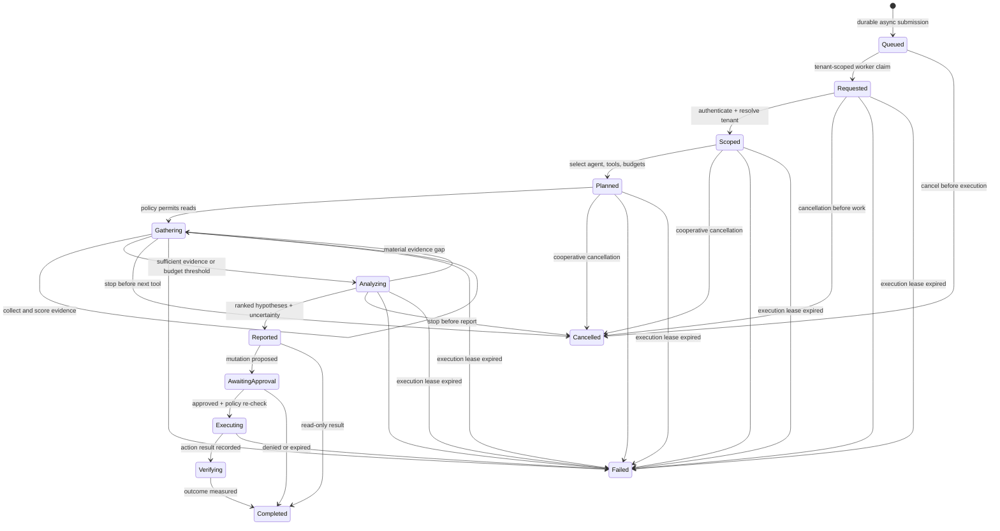

# Investigation lifecycle

**Status:** Draft contract direction  
**Date:** 2026-08-14

An investigation is a durable, bounded state machine. Model reasoning is one step inside it, not the workflow owner.

The executable reference persists asynchronous submissions before returning, with a durable tenant-local outstanding-job cap that rejects only new work and preserves exact idempotent replay. It lets competing workers claim only within configured tenant scopes, heartbeats renewable delivery leases, and reclaims expired claims. A bounded process scheduler keeps one task in flight per enrolled tenant and rotates admission, while PostgreSQL serializes same-tenant enqueue/claim admission and enforces a deployment-wide live-lease cap; slow work cannot monopolize all replicas by default. Once execution starts, the normalized request and a separate bounded running lease are durable before any tool call. The delivery lease never extends the request wall-time budget. The first authenticated cancellation request is durable and immutable; the worker checks it before execution, while the investigation checks it before new evidence calls and terminalization. A live duplicate is rejected, while a duplicate after execution-lease expiry closes the attempt without replaying tools. [ADR 0030](../decisions/0030-durable-investigation-lifecycle.md) records execution semantics, [ADR 0039](../decisions/0039-tenant-scoped-investigation-dispatch.md) records dispatch, [ADR 0060](../decisions/0060-tenant-fair-investigation-admission.md) records concurrency admission, and [ADR 0061](../decisions/0061-bounded-tenant-investigation-admission.md) records backlog admission. After terminal persistence, the same bounded timing/outcome/usage facts can produce a failure-isolated OTLP investigation span under [ADR 0031](../decisions/0031-otlp-investigation-trace-export.md); the trace is observational and never workflow authority.

## Required state

- investigation ID, tenant, actor, trigger, correlation ID;
- explicit resource and time scopes;
- selected agent/version and model class;
- allowed tools and resolved request-scoped credentials;
- wall-time, call, token, and cost budgets;
- hypotheses with supporting and contradicting evidence;
- tool-call ledger including inputs, normalized outputs, duration, and failure code;
- recommendations and proposed actions;
- policy decisions, approvals, execution attempts, verification, and terminal reason.

## Loop controls

The gathering loop must enforce a relevant-tool cap, duplicate-call cache, context budget, maximum iterations, wall-clock deadline, cost ceiling, and stagnation breaker. A conclusion may be `inconclusive`; the runtime must never manufacture certainty to satisfy a workflow.

## Evidence quality

Evidence records include origin, observation time, retrieval time, resource references, query or locator, redaction state, content hash, and a short normalized summary. Agent-produced summaries do not replace the immutable source artifact. Contradicting evidence remains visible.

Metric query candidates are declared as request upper bounds and selected only after resource classification. The runtime derives their authenticated identity, resources, time range, and deadline from the investigation, then executes them through the shared telemetry Evidence boundary. Candidate attempts consume investigation budgets, and a committed investigation replay never repeats them.

A candidate may carry a closed threshold rule tied to its root-cause classes. After Evidence commit, the runtime reads the normalized artifact back through the actor-scoped store, checks metric and unit, and records an auditable assessment. Supporting and contradicting outcomes become hypothesis citations; neutral, no-data, and incomplete outcomes stay visible. This deterministic step never rewrites the classifier's root-cause class or confidence.

A candidate may instead compare an earlier baseline window with a later evaluation window. Callers can provide explicit windows or bounded rolling durations; rolling evaluation ends at the accepted investigation scope end, with the declared gap and baseline immediately before it. The control plane validates that the derived, non-overlapping windows remain within scope and writes their absolute timestamps into the report. Both forms are evaluated from the same committed metric artifact, so the comparison adds no backend call or Evidence item. Missing window data, partial output, and a zero ratio denominator remain explicit incomplete assessments. [ADR 0032](../decisions/0032-scope-end-rolling-baseline.md) records the rolling derivation and audit semantics.

Structured Kubernetes Event candidates run before metric candidates, and historical log candidates run last so scarce budgets favor lower-risk signals. A log candidate inherits the same identity and scope and may apply only a declared record-count rule to its committed normalized result. Log body prose remains confidential untrusted input and is never used by the deterministic classifier or copied into its report.

Before those provider calls, `risk-aware-v1` produces one cross-signal plan from the validated request candidates, resource-derived classification, request upper bounds, and remaining tool/evidence capacity. Every candidate is recorded once with a stable scheduled/deferred reason. This makes budget pruning and signal ordering auditable without treating the plan as proof of execution or allowing it to synthesize new authority. [ADR 0034](../decisions/0034-auditable-cross-signal-planning.md) records this boundary.

## Evaluation boundary

Immutable [evaluation scenarios](../specifications/evaluation-scenario-contract.md) provide synthetic graph, timeline, alert, request, and evidence fixtures while keeping the scoring oracle hidden from the investigating agent. Promotion evaluates root-cause class, evidence use, red-herring resistance, unsupported certainty, instruction-boundary preservation, least privilege, and budget compliance. Adversarial fixture fragments must not appear in reports, and a plausible narrative cannot compensate for a failed evidence, instruction, or authority gate. [ADR 0033](../decisions/0033-adversarial-evidence-release-gate.md) fixes this release gate.

## Action boundary

An investigation returns recommendations or action proposals. Execution is a separate workflow with a new policy decision using current context. Approval does not transfer arbitrary authority back into the investigation loop.
