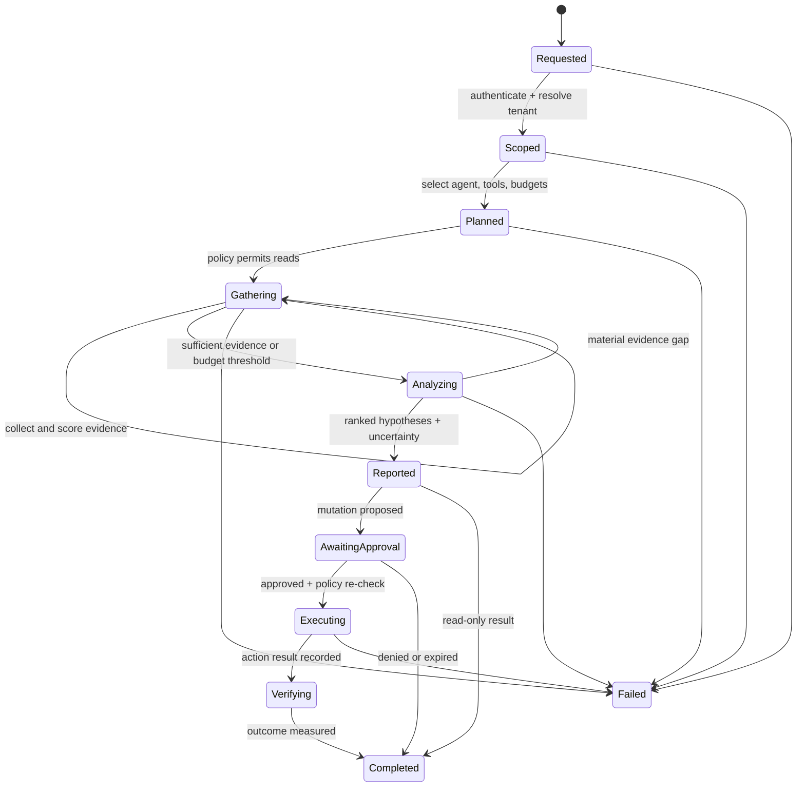

# Investigation lifecycle

**Status:** Draft contract direction  
**Date:** 2026-08-14

An investigation is a durable, bounded state machine. Model reasoning is one step inside it, not the workflow owner.

## Required state

- investigation ID, tenant, actor, trigger, correlation ID;
- explicit resource and time scopes;
- selected agent/version and model class;
- allowed tools and resolved request-scoped credentials;
- wall-time, call, token, and cost budgets;
- hypotheses with supporting and contradicting evidence;
- tool-call ledger including inputs, normalized outputs, duration, and failure code;
- recommendations and proposed actions;
- policy decisions, approvals, execution attempts, verification, and terminal reason.

## Loop controls

The gathering loop must enforce a relevant-tool cap, duplicate-call cache, context budget, maximum iterations, wall-clock deadline, cost ceiling, and stagnation breaker. A conclusion may be `inconclusive`; the runtime must never manufacture certainty to satisfy a workflow.

## Evidence quality

Evidence records include origin, observation time, retrieval time, resource references, query or locator, redaction state, content hash, and a short normalized summary. Agent-produced summaries do not replace the immutable source artifact. Contradicting evidence remains visible.

## Evaluation boundary

Immutable [evaluation scenarios](../specifications/evaluation-scenario-contract.md) provide synthetic graph, timeline, alert, request, and evidence fixtures while keeping the scoring oracle hidden from the investigating agent. Promotion evaluates root-cause class, evidence use, red-herring resistance, unsupported certainty, least privilege, and budget compliance. A plausible narrative cannot compensate for a failed evidence or authority gate.

## Action boundary

An investigation returns recommendations or action proposals. Execution is a separate workflow with a new policy decision using current context. Approval does not transfer arbitrary authority back into the investigation loop.
