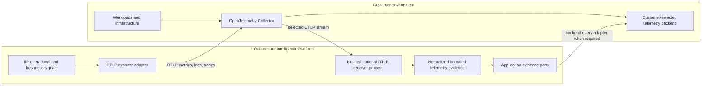

# OpenTelemetry portability boundary

**Status:** Accepted direction; outbound exporter, historical metric/log queries, isolated inbound metrics/logs receivers, metric selection, and bounded threshold/explicit/rolling/seasonal baseline assessment implemented
**Date:** 2026-08-15
**Decision:** [ADR 0012](../decisions/0012-opentelemetry-portability-boundary.md)

[OpenTelemetry](https://opentelemetry.io/docs/) is the preferred vendor-neutral telemetry interchange for the platform, but it serves two different flows. Keeping them separate prevents an export endpoint from becoming evidence authority and prevents a backend SDK from entering the application core.

## Outbound platform telemetry

The `IngestionFreshnessReport` remains the authoritative point-in-time product result. Its application service offers the same bounded measurements to a provider-neutral sink after a successful evaluation. The OpenTelemetry adapter maps them to synchronous instruments, while the official SDK's periodic reader performs OTLP/HTTP network export. A terminal `InvestigationReport` similarly drives one bounded execution span only after its report and lifecycle status are durable. OpenTelemetry packages are confined to `adapters` and composition; neither `domain` nor the use cases import them.

The adapters use the [standard exporter endpoint configuration](https://opentelemetry.io/docs/specs/otel/protocol/exporter/), including `OTEL_EXPORTER_OTLP_ENDPOINT` and signal-specific variables. The recommended target is a customer-controlled [OpenTelemetry Collector](https://opentelemetry.io/docs/collector/), which can route to a different open-source or commercial backend without an IIP code change. [ADR 0013](../decisions/0013-otlp-http-ingestion-metrics-export.md) records the metrics selection, [ADR 0031](../decisions/0031-otlp-investigation-trace-export.md) records the trace privacy/cardinality boundary, [ADR 0081](../decisions/0081-backend-neutral-otlp-receiver-availability.md) records receiver request availability, and the [operations guide](../operations/opentelemetry-export.md) lists the signals and configuration.

Export is disabled by default, asynchronous, and observational. Endpoint unavailability does not roll back ingestion, block an investigation, or change report results. The reference adapter has bounded timeouts, SDK retry behavior, local recording-failure counting, controlled dimensions, recent deployment-wide API/worker/receiver delivery health through a failure-isolated shared-store heartbeat, rolling per-signal export-attempt attainment from bounded counter samples, and a two-window burn rate calculated from the same samples. Receiver request counter/histogram observations use the same exporter but never include customer identity or payload data. It does not provide a durable queue itself; the customer-Collector's own queue depth and send-loss are a separate, opt-in report (ADR 0087) sourced from the Collector's self-metrics, not automatic discovery, and regional aggregation of it is still required before production enablement.

[ADR 0148](../decisions/0148-customer-owned-operational-alert-policy-handoff.md)
adds an optional Prometheus Operator translation for a bounded set of those
signals. The adapter stays in Helm, assumes one explicit Collector metric-name
profile, aggregates protected identities out of notification labels, and
leaves rule selection, delivery, contacts, escalation, and missing-telemetry
observation with the customer. It does not make Prometheus part of the core
portability contract.

## Customer telemetry evidence

OTLP is a push/export protocol, not a historical query protocol. The executable customer-telemetry boundaries therefore also address data already retained in a backend. `TelemetryEvidenceRequest` and `LogEvidenceRequest` express bounded normalized selectors; `TelemetryMetricsBackend` and `TelemetryLogsBackend` hide vendor query APIs; and the application validates normalized results before storing them through the immutable Evidence pipeline. [ADR 0014](../decisions/0014-backend-neutral-telemetry-evidence-query.md) records the metric decision, while [ADR 0023](../decisions/0023-backend-neutral-log-evidence-and-otlp-intake.md) records the stricter log minimization/redaction boundary. Defaults remain no-data; [ADR 0015](../decisions/0015-prometheus-telemetry-evidence-adapter.md) adds the first explicitly selected metric adapter, and [ADR 0025](../decisions/0025-loki-historical-log-evidence-adapter.md) adds the first explicitly selected historical log adapter. Both use protected catalogs and the shared credential-broker port without changing public selectors.

Optional receivers accept customer-selected OTLP/HTTP Protobuf metrics and logs streams and convert non-empty batches into bounded `OtlpMetricsEvidence` or `OtlpLogsEvidence` through the immutable Evidence pipeline. ADRs [0016](../decisions/0016-tenant-bound-otlp-metrics-receiver.md) and [0023](../decisions/0023-backend-neutral-log-evidence-and-otlp-intake.md) keep them separate because channel authentication, tenant binding, admission control, and retention authority differ from request/response queries. Protected channel profiles fix tenant, integration, resources, catalogs, attribute mappings, limits, sensitivity, and retention; payload attributes provide no authority.

[ADR 0041](../decisions/0041-isolated-otlp-receiver-process.md) gives both signals a dedicated listener and composition. The receiver has no console, interactive authenticator, control-plane operations, ambient service-account token, historical backend credentials, or action executor. Helm gives it an independent Deployment, Service, channel Secrets, request-rate budget, and Collector-selective NetworkPolicy; the control API has no OTLP routes in its OpenAPI or default runtime.

The metrics receiver accepts gauges and numeric sums. The logs receiver accepts allowlisted services, string bodies, normalized severity, mapped scalar attributes, and optional complete trace/span correlation. Both support bounded identity/gzip requests, bound time/bytes/cardinality/processing, and atomically reject unknown or unsupported semantics. Collector output is untrusted and passes allowlisting, validation, redaction, hashing, and provenance controls before becoming evidence. Traces, histograms, arbitrary retention, forwarding, and receiver-side query storage remain out of scope.

Investigations can now select provider-neutral historical metric candidates after deterministic resource classification. The candidate supplies no identity or transport authority: tenant/actor, resource/time scope, deadline, and budgets are inherited from the investigation, while endpoint and credentials remain inside the configured backend adapter. [ADR 0017](../decisions/0017-investigation-telemetry-selection.md) records this orchestration boundary.

A selected candidate may also declare a unit-aware threshold rule before execution. The rule is evaluated against the normalized artifact only after tenant-scoped Evidence commit, so replacing Prometheus with another backend does not change investigation semantics. [ADR 0018](../decisions/0018-evidence-aware-metric-assessment.md) records this interpretation boundary.

A candidate may instead declare ordered baseline and evaluation windows within the same inherited query range. Windows may be explicit or derived from bounded durations anchored at the investigation scope end. The runtime writes derived absolute ranges into the report and compares a difference or ratio from the one committed artifact without another backend call, preserving both OTLP/backend portability and investigation budgets. [ADR 0019](../decisions/0019-baseline-window-telemetry-assessment.md) records the window and failure semantics; [ADR 0032](../decisions/0032-scope-end-rolling-baseline.md) records rolling derivation.

Fixed-period seasonal rules extend that same one-query boundary. Two to twelve matching prior windows are derived from the scope end in nearest-first order, every window must contain data, and their values are aggregated by mean or median before the declared difference or ratio is assessed. The wider query range remains bounded to 90 days and retains the existing result and deadline ceilings. [ADR 0076](../decisions/0076-deterministic-seasonal-telemetry-baseline.md) records these semantics.

## Security and tenancy

- Endpoint credentials and custom OTLP headers are secret references or protected runtime configuration, never public resource/report fields.
- Tenant and integration scope come from authenticated channel configuration, not OTLP resource attributes supplied by a workload.
- Tenant/source attributes are exported only under explicit deployment policy because they can be sensitive and high-cardinality.
- Prompts, raw logs, evidence bodies, resource contents, provider errors, credentials, and actor identity never enter exported platform telemetry.
- Investigation and tenant identifiers are absent from traces by default and require an explicit privacy/cardinality mode.
- Receivers and exporters have explicit network destinations, deadlines, payload bounds, and no ambient credentials.

## Pending implementation decisions

- whether later pushed signals use immutable Evidence only, customer storage forwarding, or a hybrid policy;
- a production credential issuer and customer-specific interoperability qualification plus additional historical log and metric adapters; the local real-TLS broker-client profile is delivered;
- customer-PKI receiver identity portability beyond the accepted mutual-TLS
  SPIFFE profile, automated token/CA rotation, distributed gateway admission,
  and measured persistent-queue sizing/loss objectives for self-hosted,
  customer-hosted, and managed deployments;
- retention, sampling, cardinality budgets, and regional/data-residency controls;
- queue durability and the division of retry, batching, and end-to-end delivery-SLO ownership between the official SDK and a sidecar/customer Collector;
- the cadence and ownership of automatic freshness evaluation and production SLO windows;
- calendar-aware or learned baselines, minimum sample counts, and multi-signal reasoning.

External-broker, additional backend, learned/calendar-aware baseline and broader
multi-signal reasoning, and expanded-signal decisions belong to the Phase 2
telemetry-evidence slice. ADR 0080 now fixes the local production receiver
profile: CA-verified SPIFFE mTLS plus a separate tenant-bound channel credential,
PostgreSQL commit before success, and a customer-Collector persistent sending
queue for pre-receiver buffering. Receiver HTTP availability semantics and
backend-neutral export are accepted in ADR 0081. ADR 0082 adds a two-window
IIP-to-Collector burn-rate report over the same samples; ADR 0087 adds a
separate Collector-to-backend queue/loss objective sourced from the
Collector's own self-metrics. ADRs 0088 and 0089 additionally enforce a
configured client CRL and fail readiness/intake when its validity window
closes. ADR 0090 proves a root/intermediate/leaf client hierarchy plus
activation of a newer CRL through an explicit receiver rollout.
Customer-specific PKI/OCSP and CRL-distribution qualification, regional
aggregation of the queue/loss objective, and notification routing remain
Phase 3 operational-hardening gates.
