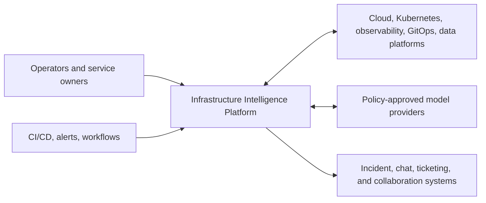
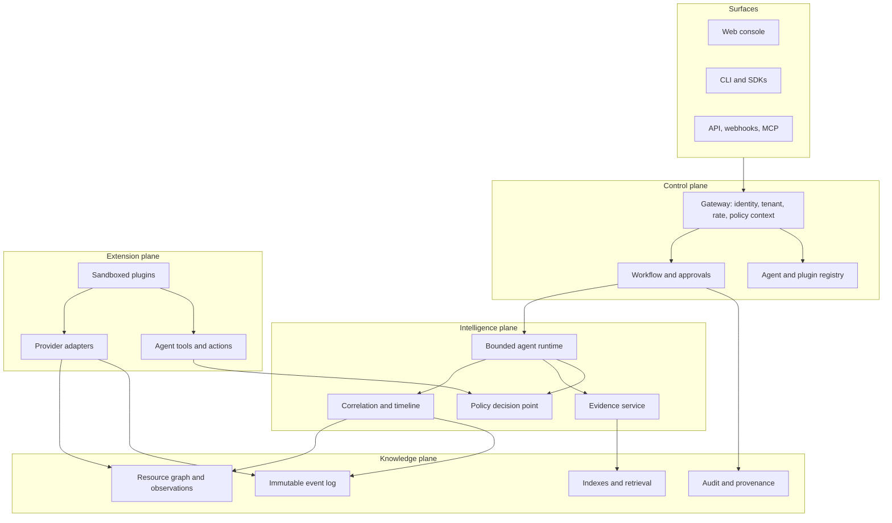

# Architecture overview

**Status:** Accepted foundation  
**Date:** 2026-08-14

## System context

The platform sits above existing infrastructure and operations systems. It does not become the source of credentials or replace provider control planes.

## Logical architecture

## Core data flow

1. An integration observes an external object and submits a canonical resource observation.
2. Identity resolution maps `(tenant, provider, type, external ID)` to a stable platform UID.
3. The graph stores the latest view and observation provenance; a resource event enters the immutable log.
4. Correlation attaches events to resources, relationships, deployments, incidents, and investigations.
5. A surface or rule creates a scoped investigation request.
6. The runtime selects an agent manifest, resolves allowed tools, applies budgets, and gathers evidence.
7. The agent emits ranked hypotheses and recommendations with evidence references and uncertainty.
8. Proposed mutations enter a workflow. Policy and approval decide whether an action may execute.
9. The action attempt is durably claimed before any executor call. Expired ambiguous attempts fail closed for manual reconciliation instead of being replayed.
9. Every decision, tool call, approval, execution, and result produces audit events.

Collector plugins cross the extension boundary through bounded resource collection request/result contracts. A complete batch returns an explicit scope digest, candidate checkpoint, and optional opaque provider cursor map; only the trusted ingestion workflow may commit that state after every resource observation and event is durable. The host stores the last complete source membership and generates deterministic tombstones for resources missing from the next complete snapshot. Membership, tombstones, checkpoint, and provider cursors commit together. Partial, failed, cancelled, stale-resume, or scope-drifted passes never imply deletion. [ADR 0007](../decisions/0007-reconciliation-membership-and-tombstones.md) records membership authority, and [ADR 0009](../decisions/0009-provider-cursor-sets-and-watch-recovery.md) records list/watch recovery.

The [ingestion freshness boundary](ingestion-freshness-telemetry.md) evaluates that committed checkpoint together with the latest accepted source observation and pending transactional-outbox delivery. This makes complete-source lag and downstream backlog measurable without exposing opaque provider state. [ADR 0055](../decisions/0055-bounded-outbox-quarantine.md) removes terminal failures from the pending path after a finite attempt budget while retaining them in exact-tenant value-minimized quarantine health. [ADR 0056](../decisions/0056-governed-event-delivery-replay.md) recovers only one immutable quarantine generation through the same investigation, policy, independent approval, one-shot claim, and audit chain as other governed actions. [ADR 0057](../decisions/0057-event-delivery-slo-semantics.md) measures one durable outbox row once after its publication deadline and exposes a deployment-configured rolling attainment report without coupling to the publisher transport. [ADR 0011](../decisions/0011-ingestion-freshness-semantics.md) defines the point-in-time Phase 1 semantics. The optional exporter described by [ADR 0013](../decisions/0013-otlp-http-ingestion-metrics-export.md) maps successful evaluations to OTLP/HTTP metrics. [ADR 0043](../decisions/0043-explicit-ingestion-freshness-sampling.md) keeps evaluations active through a tenant/source-enrolled non-interactive worker. [ADR 0059](../decisions/0059-backend-neutral-query-availability-telemetry.md) measures recognized read operations at the HTTP response boundary with closed privacy-safe labels and deployment-owned objectives, then exports them through the same replaceable OTLP metrics path. [ADR 0052](../decisions/0052-process-local-telemetry-export-health.md) exposes bounded latest exporter outcomes without making optional telemetry a serving dependency. [ADR 0072](../decisions/0072-deployment-wide-telemetry-export-health.md) adds failure-isolated pseudonymous API/worker heartbeats and one shared-store deployment view. [ADR 0073](../decisions/0073-sampled-telemetry-export-slo.md) retains bounded counter samples and measures rolling per-signal successful-export-attempt attainment. [ADR 0082](../decisions/0082-multi-window-telemetry-export-burn-rate.md) calculates a two-window error-budget burn rate from those same samples, reporting `critical` only when both windows agree. Both measure IIP's own outbound exporter attempts (IIP-to-Collector reliability); [ADR 0087](../decisions/0087-collector-observed-queue-loss-objective.md) measures the customer OpenTelemetry Collector's own sending-queue depth and send-loss for its pipeline to IIP (Collector-to-backend reliability) by querying the Collector's self-metrics through the existing backend-neutral `TelemetryMetricsBackend` port; regional aggregation and customer alert routing remain operational-hardening work.

The signed plugin runner claims each exact-tenant request against its persisted
session and canonical invocation digest before a container starts. PostgreSQL
serializes the session request limit across replicas, retains host-created
terminal results, serves exact completed retries without execution, and leaves
crash-ambiguous claims closed for explicit reconciliation. The API pod still has
no container-runtime socket. Read grants keep credentials and networking on the
host under [ADR 0066](../decisions/0066-host-mediated-plugin-read-connectivity.md).
Proposal-only action grants under
[ADR 0070](../decisions/0070-proposal-only-plugin-action-mediation.md) can enter
the ordinary governed approval queue but never grant approval, execution, or a
provider credential. The exact-host Docker profile in
[ADR 0071](../decisions/0071-executable-action-provider-compatibility-profile.md)
executes that path through an isolated SDK-only process and proves host state
stops at a pending proposal. Durable host-side plugin cancellation and
administrator-only post-deadline reconciliation are defined by
[ADR 0065](../decisions/0065-plugin-invocation-cancellation-and-reconciliation.md).
[ADR 0064](../decisions/0064-durable-plugin-invocation-ownership.md) records the
ownership and recovery boundary.

[OpenTelemetry portability](opentelemetry-portability.md) separates outbound platform observability from inbound customer telemetry evidence. OTLP is the preferred replaceable transport and a customer-controlled Collector is the preferred routing boundary, while historical backend queries use application-owned metric and log ports because OTLP does not define a query API. [ADR 0012](../decisions/0012-opentelemetry-portability-boundary.md) keeps both directions outside the provider-neutral kernel. Application-owned measurement sinks now drive bounded ingestion metrics and terminal investigation traces, with trace privacy/cardinality fixed by [ADR 0031](../decisions/0031-otlp-investigation-trace-export.md); exporter decorators report backend-neutral delivery outcomes through the privileged operations contract fixed by ADR 0052. [ADR 0014](../decisions/0014-backend-neutral-telemetry-evidence-query.md) fixes the normalized metric request/result and Evidence boundary, [ADR 0015](../decisions/0015-prometheus-telemetry-evidence-adapter.md) adds the first allowlisted Prometheus-compatible adapter, [ADR 0016](../decisions/0016-tenant-bound-otlp-metrics-receiver.md) adds an optional tenant-bound OTLP metrics receiver, and [ADR 0023](../decisions/0023-backend-neutral-log-evidence-and-otlp-intake.md) adds separate bounded log query and OTLP logs intake boundaries. [ADR 0041](../decisions/0041-isolated-otlp-receiver-process.md) moves both signals onto a dedicated listener with independent credentials, admission, scaling, OpenAPI, and network policy. [ADR 0080](../decisions/0080-mutual-tls-otlp-workload-identity-and-buffering.md) requires CA-verified SPIFFE-to-channel identity plus a separate Bearer factor, defines PostgreSQL commit as the success boundary, and keeps outage buffering in the customer Collector's persistent sending queue. [ADR 0081](../decisions/0081-backend-neutral-otlp-receiver-availability.md) measures privacy-bounded metrics/logs intake outcomes through that same replaceable outbound OTLP boundary and exposes receiver exporter delivery in the shared operations view. [ADRs 0088](../decisions/0088-otlp-receiver-revoked-certificate-rejection-evidence.md) and [0089](../decisions/0089-fail-closed-otlp-client-crl-freshness.md) enforce a configured client CRL and remove the receiver from readiness and intake when its bounded validity window closes. [ADR 0090](../decisions/0090-intermediate-ca-and-otlp-crl-rollout-evidence.md) proves a root/intermediate/leaf workload chain and makes CRL activation an explicit projected-file plus receiver-rollout operation. Vendor SDKs, Protobuf types, and query languages remain in surfaces/adapters and composition.

Evidence providers cross a separate application-owned boundary. The [reference collection pipeline](evidence-collection-pipeline.md) authorizes an exact tenant, integration, evidence type, and resource scope before a provider runs, then validates and redacts provider output before hashing and atomic persistence. Providers do not receive ambient credentials through the application contract.

Historical log evidence uses logical service names, normalized severities, exact attribute filters, and explicit record/time/byte budgets through `TelemetryLogsBackend`; the default adapter returns honest no-data. The first live adapter maps that closed selector to Loki range queries using protected tenant, endpoint, organization, label, service, severity, and credential configuration, and a second live adapter maps the same closed selector to OpenSearch document search using protected tenant, endpoint, index, field, service, severity, and credential configuration, proving the boundary against two structurally different backends. Investigations can select those queries under inherited authority and apply only a predeclared record-count rule to the committed artifact; log body prose remains untrusted and uninterpreted. A separately authenticated OTLP `/v1/logs` receiver binds each channel to one tenant, integration, resource, service catalog, attribute map, and handling policy before normalizing string bodies and optional trace context. Both paths redact bodies before persistence, and neither accepts payload tenancy or vendor query language as authority. [ADR 0025](../decisions/0025-loki-historical-log-evidence-adapter.md) records the Loki translation and trust boundary, and [ADR 0084](../decisions/0084-opensearch-historical-log-evidence-adapter.md) records the OpenSearch translation and trust boundary.

Customer Kubernetes Events use that Evidence boundary rather than the internal CloudEvents history contract. `KubernetesEventsBackend` receives only authenticated scope, normalized external resource identities, filters, time, and limits. The first live adapter performs exact-object and UID-scoped Event reads through the Kubernetes HTTPS API with protected tenant integration, CA, allowlist, and credential configuration. [ADR 0020](../decisions/0020-kubernetes-event-evidence-and-correlation.md) fixes the separation, normalization, and investigation-correlation rules; [ADR 0021](../decisions/0021-read-only-kubernetes-event-api-adapter.md) fixes the live read-only transport and authority boundary.

Resource/deployment changes are derived from accepted immutable observations through a separate bounded Evidence operation. Results contain categorized paths and before/after observation hashes rather than copied values, so investigations can establish that an image, desired scale, configuration, relationship, status, creation, or deletion changed without expanding secret exposure. Truncated history scans remain explicitly partial. [ADR 0026](../decisions/0026-resource-history-change-evidence.md) fixes this first change-evidence boundary.

Repository and runbook context is retrieved through another backend-neutral Evidence operation. Public requests use protected logical references and closed document kinds; the first adapter reads only allowlisted UTF-8 files beneath a mounted root. Excerpts are bounded, redacted, content-hashed, and marked untrusted data with no instruction authority. Investigations can select those references under inherited authority and assess a predeclared document-count rule against the committed artifact; only document IDs and logical references enter the report. [ADR 0028](../decisions/0028-untrusted-context-evidence.md) fixes the context and prompt-injection boundary, and [ADR 0029](../decisions/0029-investigation-context-correlation.md) fixes conservative correlation.

Provider credentials stay behind the application-owned `CredentialBroker` port. Static protected-JSON brokers remain development fallbacks; the external client sends the exact tenant/actor/integration/provider/scope/deadline tuple to a separately operated HTTPS broker authenticated by an explicitly projected workload token. It validates correlation and short lease lifetime, then returns secret material only to the requesting adapter. [ADR 0022](../decisions/0022-external-workload-identity-credential-broker.md) fixes this client boundary. [ADR 0077](../decisions/0077-executable-credential-broker-compatibility-evidence.md) adds source-bound real-TLS evidence for identity enforcement, exact policy, rotation/revocation, audit minimization, outage, and recovery against a disposable local fixture. The production issuer, revocation system, and audit service are still separately operated and not implemented in this repository; customer-specific qualification remains required.

The current executable intelligence slice is deterministic and model-free: it collects canonical resource-state evidence, classifies a narrow Kubernetes failure set, plans bounded provider-neutral Kubernetes Event, repository/runbook context, resource-change, metric, and historical log candidates across remaining budgets, evaluates caller-declared condition-count, document-count, change-count, unit-aware threshold, explicit or scope-end rolling baseline-window, or log-record-count rules against committed artifacts, and produces the same immutable report contract intended for future bounded agents. The normalized request and a bounded execution lease become durable before tools run; cooperative cancellation is checked between calls, live duplicates are rejected, and expired attempts close without replaying tools. Selected signals inherit investigation identity, resource/time scope, deadline, and tool/evidence budgets and pass through the normal Evidence pipeline. The auditable plan records every candidate's scheduled/deferred decision; Events execute first, protected context next, value-minimized internal changes next, external metrics next, and logs last for deterministic risk-aware budget ordering. If a scheduled provider fails without committing Evidence, one accepted candidate initially deferred for exhausted capacity can be promoted after all pending scheduled work is reserved; the report records the transition without provider detail or new authority. Baseline/evaluation windows are split from one stored result rather than fetched through hidden queries, and rolling rules record the exact derived ranges in the report. Supporting and contradicting assessments are cited without silently changing classifier output. The evaluation harness scores machine-readable root-cause classes, evidence use, red-herring and adversarial-instruction resistance, unsupported certainty, and budget compliance. [ADR 0006](../decisions/0006-deterministic-investigation-and-dry-run-actions.md) fixes the runtime baseline, [ADR 0017](../decisions/0017-investigation-telemetry-selection.md) fixes metric selection authority, [ADR 0018](../decisions/0018-evidence-aware-metric-assessment.md) fixes the first interpretation boundary, [ADR 0019](../decisions/0019-baseline-window-telemetry-assessment.md) fixes two-window comparison semantics, [ADR 0020](../decisions/0020-kubernetes-event-evidence-and-correlation.md) fixes event normalization and correlation, [ADR 0024](../decisions/0024-investigation-log-selection-and-assessment.md) fixes conservative log selection and assessment, [ADR 0027](../decisions/0027-investigation-change-correlation.md) fixes value-minimized change correlation, [ADR 0029](../decisions/0029-investigation-context-correlation.md) fixes untrusted context correlation, [ADR 0030](../decisions/0030-durable-investigation-lifecycle.md) fixes lifecycle recovery and cancellation, [ADR 0032](../decisions/0032-scope-end-rolling-baseline.md) fixes rolling derivation, [ADR 0034](../decisions/0034-auditable-cross-signal-planning.md) fixes initial cross-signal planning provenance, [ADR 0075](../decisions/0075-bounded-adaptive-signal-replanning.md) fixes the single-promotion boundary, [ADR 0076](../decisions/0076-deterministic-seasonal-telemetry-baseline.md) fixes fixed-period seasonal derivation, and [ADR 0083](../decisions/0083-calendar-aware-seasonal-baseline.md) adds optional calendar-day-aligned seasonal derivation.

Reviewed tenant profiles can now supply those closed candidates automatically when a caller leaves a signal list empty. The authenticated preparation boundary freezes generated candidates and their profile/resolved-subset digests into the durable request; workers verify that snapshot without re-reading mutable configuration. Explicit caller candidates win per signal, while request evidence/tool upper bounds, budgets, policy, provider allowlists, credential leases, resource scope, and time scope remain authoritative. Reports label every plan step as request- or protected-catalog-originated. [ADR 0054](../decisions/0054-protected-investigation-signal-catalog.md) fixes this provenance and authority boundary.

Actions cross a stricter workflow boundary. Proposal, approval, and execution are distinct policy checks and immutable records; self-approval is prohibited and duplicate execution returns the prior result. The reference executor is dry-run only. Plugin sessions similarly grant only a declared capability subset, persist only token references/digests, and carry mandatory expiry, cancellation, and resource limits.

Authenticated investigations may also enter a durable tenant-scoped PostgreSQL queue. Competing workers use private claims, renewable delivery heartbeats, bounded retries, and conservative crash recovery; these never extend the immutable request's wall-time budget or execution lease. [ADR 0058](../decisions/0058-investigation-completion-slo-semantics.md) measures each durable job once after its completion deadline and treats only an on-time useful report as success. [ADR 0074](../decisions/0074-executable-investigation-capacity-evidence.md) binds large-tenant admission, overload isolation, live-lease caps, and terminal capacity release to one executable aggregate-only PostgreSQL profile; customer workload sizing remains environment-specific. The same tenant-explicit workflow process scans expired action attempts, atomically marks ambiguity with one audit record, and never invokes an executor; unexecuted proposal expiry is derived without rewriting proposal digests. [ADR 0039](../decisions/0039-tenant-scoped-investigation-dispatch.md) records dispatch and [ADR 0040](../decisions/0040-action-timers-and-fail-closed-reconciliation.md) records action timers.

## Storage responsibilities

The logical boundaries remain product-neutral. [ADR 0004](../decisions/0004-postgresql-observation-store-and-outbox.md) selects PostgreSQL for the initial resource/observation, event-log, checkpoint, and outbox substrate while leaving other stores and later transport specialization open:

| Store | Responsibility | Required semantics |
| --- | --- | --- |
| Resource graph | PostgreSQL latest view, immutable observations, and rebuildable relationship index | Tenant partitioning; idempotent upsert; time-aware provenance |
| Event log | PostgreSQL immutable log and transactional outbox initially | At-least-once ingestion; deduplication by source + ID; replay |
| Evidence store | PostgreSQL metadata and artifact bytes initially | Immutable versions; tenant partitioning; retention policy; redaction metadata |
| Workflow store | PostgreSQL investigations, approvals, idempotency, and results initially | Crash-safe immutable transitions; duplicate-impact prevention |
| Registry | Versioned agent/plugin manifests | Immutable releases; signatures and compatibility metadata |
| Search/index | Derived query acceleration | Rebuildable from authoritative stores |
| Audit store | Security and decision trail | Append-only; protected retention; exportability |

## Deployment shape

Start as a modular control-plane service plus asynchronous workers. Preserve logical boundaries in packages and contracts before splitting into network services. Split only when scaling, isolation, or independent failure domains justify the operational cost.

The Helm chart deploys every application workload from one optional immutable OCI digest, accepts existing Secret references for PostgreSQL and identity configuration, and can enable a separate workflow-worker Deployment only with explicit tenant enrollment. It handles investigation dispatch, non-executing action timers, optional exact-source freshness sampling, and optional transactional-outbox delivery. The worker receives no interactive authentication Secret, mounts no ambient service-account token, and does not compose an action executor. Its opt-in HTTPS event publisher has exact worker-tenant authority, a separately mounted rotating token, and a dedicated no-ingress NetworkPolicy. The API Service stays cluster-internal; optional external access is an existing-certificate TLS Ingress with explicit class, host, redirect annotation, and exact ingress-controller NetworkPolicy peer. A separate optional backup CronJob receives only database and pre-created-PVC authority, writes checksum-complete logical dumps, and has a live isolated restore gate. Enabling metrics or logs intake creates a separate OTLP receiver Deployment and Service; only that pod receives channel credentials, server keypair, client CA, optional current client CRL, and SPIFFE registry, it exposes no control routes, and its NetworkPolicy can admit only selected Collector pods. A version-named CRL Secret reference creates an observable receiver rollout; projected file changes are never treated as live SSL-context reload. Planned components still include a dedicated ingestion worker, a correlator, a dedicated plugin-runner deployment, and backing services. The [first plugin runtime](plugin-runtime.md) is executable through a local Docker conformance gate, but the API pod intentionally receives no container-runtime socket. Data-plane collectors may run in customer clusters and send normalized observations through mutually authenticated, tenant-scoped channels.

[ADR 0042](../decisions/0042-dependency-aware-readiness.md) separates dependency-free process liveness from serving readiness. PostgreSQL-backed API and OTLP receiver processes enter rotation only after a bounded connection verifies the latest packaged schema migration; failures return one non-secret status and never apply migrations. [ADR 0045](../decisions/0045-controlled-helm-schema-migrations.md) adds a separately enabled pre-install/pre-upgrade Job that receives only database authority and must succeed before Helm rolls serving workloads. [ADR 0049](../decisions/0049-least-authority-scheduled-logical-backups.md) keeps backup scheduling in a separate database-and-PVC-only CronJob and requires a checksum-complete artifact before restore. [ADR 0050](../decisions/0050-immutable-application-image-identity.md) binds all application workloads to the same configured OCI digest. Request-scoped external providers retain their owning fail-closed behavior rather than receiving synthetic health traffic.

The API image also serves a dependency-free same-origin web console. It is a real control-plane surface over public contracts: the console discovers a non-secret local-token, issued-access-token, or OIDC Authorization Code + `S256` PKCE profile; authenticates the resulting credential; reads the derived session context; proves the answering process's application/contract/storage/build/deployment identity; lists tenant resources; opens graph/timeline views; runs bounded investigations; follows Evidence citations; presents exact-tenant event-delivery health and rolling publication attainment; and presents a tenant-scoped governed-action queue for Kubernetes restart and exact-generation quarantine recovery. The runtime report uses the embedded release revision plus Helm-supplied chart and immutable image digest when available; it never guesses identity from a mutable tag. The queue reads each proposal, approval, execution lifecycle, and result in one repository snapshot, then exposes only role-appropriate decision or execution controls. It stores no platform data of its own and does not bypass application ports. The local Docker lifecycle creates a hardened non-root API container and durable PostgreSQL stack. A separate executable real-TLS profile proves the OIDC/JWKS verifier's exact claims, cache/rotation, outage/recovery, and minimized PKCE discovery; customer issuer interoperability, ingress, MFA/session/logout, and redirect/CORS policy remain deployment qualification decisions.

Governed execution follows [ADR 0035](../decisions/0035-one-shot-action-execution.md). Proposal parameters are closed and identity-bound. The store atomically owns the sole execution claim; current policy is re-evaluated over content digests immediately before the claim. Result and terminal lifecycle state commit together, while an expired non-terminal claim becomes manual reconciliation rather than a retry. [ADR 0037](../decisions/0037-oidc-and-external-policy-boundaries.md) adds OIDC/JWKS identity and a fail-closed external policy adapter without moving identity or policy-vendor behavior into application packages. [ADR 0079](../decisions/0079-executable-policy-engine-compatibility-evidence.md) proves that adapter's exact digest/snapshot binding, credential rotation, failure behavior, and recovery over real local TLS. Customer policy-bundle correctness and availability remain deployment gates. This is the safety prerequisite for the disabled-by-default live Kubernetes executor.

The opt-in executor in [ADR 0036](../decisions/0036-request-scoped-kubernetes-restart.md) is the first live-capable adapter. It derives a protected integration from the observed source, checks the observed Kubernetes UID, requests a two-scope lease, uses server-side dry-run and resource-version preconditions, changes one fixed pod-template annotation, verifies controller readiness, and restores the prior annotation after failed verification. The locally composed executor and Helm default remain non-mutating.

## Cross-cutting invariants

- Tenant ID, actor ID, and roles are derived through the [authentication boundary](authentication-boundary.md), not trusted from payloads or identity assertion headers.
- Source events are immutable; corrections are new events.
- Resource identity is stable across observations and display-name changes.
- Side effects carry idempotency keys and emit before/after audit records.
- Tool output is untrusted and cannot directly modify policy or authority.
- Secrets are referenced by logical name and resolved at execution time; they never enter contracts or prompts.
- Derived indexes and summaries are rebuildable from authoritative data and provenance.
