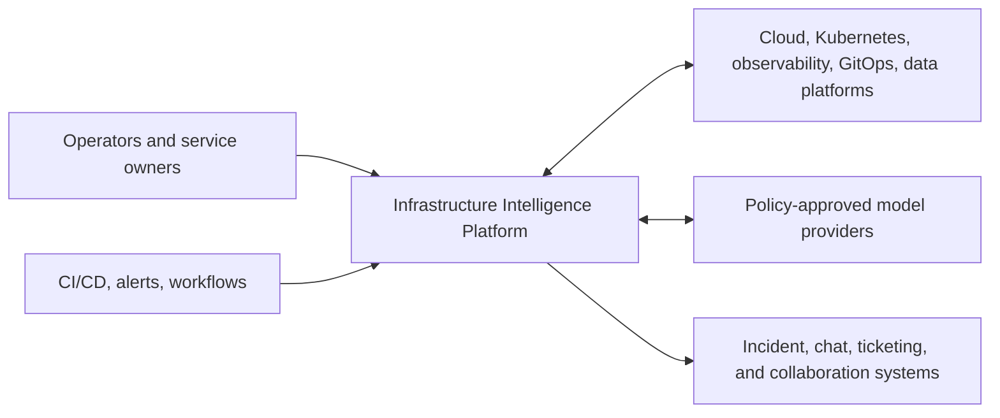
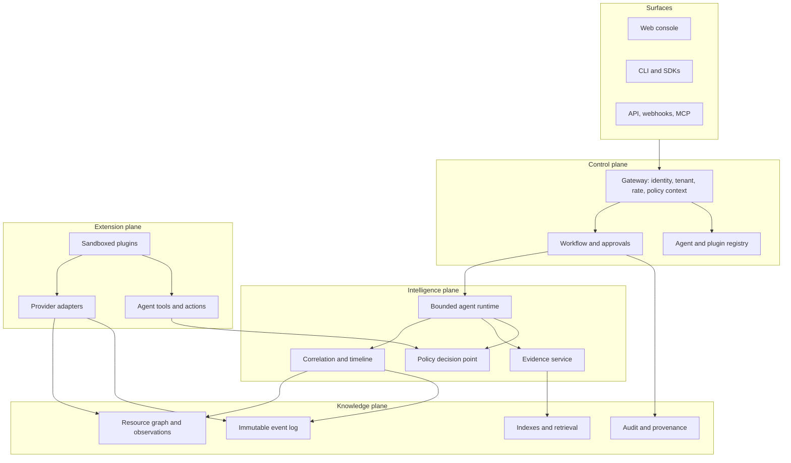

# Architecture overview

**Status:** Accepted foundation  
**Date:** 2026-08-14

## System context

The platform sits above existing infrastructure and operations systems. It does not become the source of credentials or replace provider control planes.

## Logical architecture

## Core data flow

1. An integration observes an external object and submits a canonical resource observation.
2. Identity resolution maps `(tenant, provider, type, external ID)` to a stable platform UID.
3. The graph stores the latest view and observation provenance; a resource event enters the immutable log.
4. Correlation attaches events to resources, relationships, deployments, incidents, and investigations.
5. A surface or rule creates a scoped investigation request.
6. The runtime selects an agent manifest, resolves allowed tools, applies budgets, and gathers evidence.
7. The agent emits ranked hypotheses and recommendations with evidence references and uncertainty.
8. Proposed mutations enter a workflow. Policy and approval decide whether an action may execute.
9. Every decision, tool call, approval, execution, and result produces audit events.

Collector plugins cross the extension boundary through bounded resource collection request/result contracts. A complete batch returns an explicit scope digest, candidate checkpoint, and optional opaque provider cursor map; only the trusted ingestion workflow may commit that state after every resource observation and event is durable. The host stores the last complete source membership and generates deterministic tombstones for resources missing from the next complete snapshot. Membership, tombstones, checkpoint, and provider cursors commit together. Partial, failed, cancelled, stale-resume, or scope-drifted passes never imply deletion. [ADR 0007](../decisions/0007-reconciliation-membership-and-tombstones.md) records membership authority, and [ADR 0009](../decisions/0009-provider-cursor-sets-and-watch-recovery.md) records list/watch recovery.

The [ingestion freshness boundary](ingestion-freshness-telemetry.md) evaluates that committed checkpoint together with the latest accepted source observation and pending transactional-outbox delivery. This makes complete-source lag and downstream backlog measurable without exposing opaque provider state. [ADR 0011](../decisions/0011-ingestion-freshness-semantics.md) defines the point-in-time Phase 1 semantics. The optional exporter described by [ADR 0013](../decisions/0013-otlp-http-ingestion-metrics-export.md) maps successful evaluations to OTLP/HTTP metrics; automatic sampling, production export-health gates, and SLO windows remain operational-hardening work.

[OpenTelemetry portability](opentelemetry-portability.md) separates outbound platform observability from inbound customer telemetry evidence. OTLP is the preferred replaceable transport and a customer-controlled Collector is the preferred routing boundary, while historical backend queries use application-owned metric and log ports because OTLP does not define a query API. [ADR 0012](../decisions/0012-opentelemetry-portability-boundary.md) keeps both directions outside the provider-neutral kernel. The first outbound adapter uses the application-owned measurement sink, [ADR 0014](../decisions/0014-backend-neutral-telemetry-evidence-query.md) fixes the normalized metric request/result and Evidence boundary, [ADR 0015](../decisions/0015-prometheus-telemetry-evidence-adapter.md) adds the first allowlisted Prometheus-compatible adapter, [ADR 0016](../decisions/0016-tenant-bound-otlp-metrics-receiver.md) adds an optional tenant-bound OTLP metrics receiver, and [ADR 0023](../decisions/0023-backend-neutral-log-evidence-and-otlp-intake.md) adds separate bounded log query and OTLP logs intake boundaries. Vendor SDKs, Protobuf types, and query languages remain in surfaces/adapters and composition.

Evidence providers cross a separate application-owned boundary. The [reference collection pipeline](evidence-collection-pipeline.md) authorizes an exact tenant, integration, evidence type, and resource scope before a provider runs, then validates and redacts provider output before hashing and atomic persistence. Providers do not receive ambient credentials through the application contract.

Historical log evidence uses logical service names, normalized severities, exact attribute filters, and explicit record/time/byte budgets through `TelemetryLogsBackend`; the default adapter returns honest no-data. The first live adapter maps that closed selector to Loki range queries using protected tenant, endpoint, organization, label, service, severity, and credential configuration. Investigations can select those queries under inherited authority and apply only a predeclared record-count rule to the committed artifact; log body prose remains untrusted and uninterpreted. A separately authenticated OTLP `/v1/logs` receiver binds each channel to one tenant, integration, resource, service catalog, attribute map, and handling policy before normalizing string bodies and optional trace context. Both paths redact bodies before persistence, and neither accepts payload tenancy or vendor query language as authority. [ADR 0025](../decisions/0025-loki-historical-log-evidence-adapter.md) records the Loki translation and trust boundary.

Customer Kubernetes Events use that Evidence boundary rather than the internal CloudEvents history contract. `KubernetesEventsBackend` receives only authenticated scope, normalized external resource identities, filters, time, and limits. The first live adapter performs exact-object and UID-scoped Event reads through the Kubernetes HTTPS API with protected tenant integration, CA, allowlist, and credential configuration. [ADR 0020](../decisions/0020-kubernetes-event-evidence-and-correlation.md) fixes the separation, normalization, and investigation-correlation rules; [ADR 0021](../decisions/0021-read-only-kubernetes-event-api-adapter.md) fixes the live read-only transport and authority boundary.

Resource/deployment changes are derived from accepted immutable observations through a separate bounded Evidence operation. Results contain categorized paths and before/after observation hashes rather than copied values, so investigations can establish that an image, desired scale, configuration, relationship, status, creation, or deletion changed without expanding secret exposure. Truncated history scans remain explicitly partial. [ADR 0026](../decisions/0026-resource-history-change-evidence.md) fixes this first change-evidence boundary.

Repository and runbook context is retrieved through another backend-neutral Evidence operation. Public requests use protected logical references and closed document kinds; the first adapter reads only allowlisted UTF-8 files beneath a mounted root. Excerpts are bounded, redacted, content-hashed, and marked untrusted data with no instruction authority. [ADR 0028](../decisions/0028-untrusted-context-evidence.md) fixes the context and prompt-injection boundary.

Provider credentials stay behind the application-owned `CredentialBroker` port. Static protected-JSON brokers remain development fallbacks; the external client sends the exact tenant/actor/integration/provider/scope/deadline tuple to a separately operated HTTPS broker authenticated by an explicitly projected workload token. It validates correlation and short lease lifetime, then returns secret material only to the requesting adapter. [ADR 0022](../decisions/0022-external-workload-identity-credential-broker.md) fixes this client boundary; the external issuer, revocation system, and audit service are not implemented in this repository.

The current executable intelligence slice is deterministic and model-free: it collects canonical resource-state evidence, classifies a narrow Kubernetes failure set, selects bounded provider-neutral Kubernetes Event, resource-change, metric, and historical log queries whose applicability matches that classification, evaluates caller-declared condition-count, change-count, unit-aware threshold, baseline-window, or log-record-count rules against committed artifacts, and produces the same immutable report contract intended for future bounded agents. Selected signals inherit investigation identity, resource/time scope, deadline, and tool/evidence budgets and pass through the normal Evidence pipeline. Event selections execute first, value-minimized internal changes next, external metrics next, and logs last for deterministic risk-aware budget ordering; baseline/evaluation windows are split from one stored result rather than fetched through hidden queries. Supporting and contradicting assessments are cited without silently changing classifier output. The evaluation harness scores machine-readable root-cause classes, evidence use, red-herring resistance, unsupported certainty, and budget compliance. [ADR 0006](../decisions/0006-deterministic-investigation-and-dry-run-actions.md) fixes the runtime baseline, [ADR 0017](../decisions/0017-investigation-telemetry-selection.md) fixes metric selection authority, [ADR 0018](../decisions/0018-evidence-aware-metric-assessment.md) fixes the first interpretation boundary, [ADR 0019](../decisions/0019-baseline-window-telemetry-assessment.md) fixes two-window comparison semantics, [ADR 0020](../decisions/0020-kubernetes-event-evidence-and-correlation.md) fixes event normalization and correlation, [ADR 0024](../decisions/0024-investigation-log-selection-and-assessment.md) fixes conservative log selection and assessment, and [ADR 0027](../decisions/0027-investigation-change-correlation.md) fixes value-minimized change correlation.

Actions cross a stricter workflow boundary. Proposal, approval, and execution are distinct policy checks and immutable records; self-approval is prohibited and duplicate execution returns the prior result. The reference executor is dry-run only. Plugin sessions similarly grant only a declared capability subset, persist only token references/digests, and carry mandatory expiry, cancellation, and resource limits.

## Storage responsibilities

The logical boundaries remain product-neutral. [ADR 0004](../decisions/0004-postgresql-observation-store-and-outbox.md) selects PostgreSQL for the initial resource/observation, event-log, checkpoint, and outbox substrate while leaving other stores and later transport specialization open:

| Store | Responsibility | Required semantics |
| --- | --- | --- |
| Resource graph | PostgreSQL latest view, immutable observations, and rebuildable relationship index | Tenant partitioning; idempotent upsert; time-aware provenance |
| Event log | PostgreSQL immutable log and transactional outbox initially | At-least-once ingestion; deduplication by source + ID; replay |
| Evidence store | PostgreSQL metadata and artifact bytes initially | Immutable versions; tenant partitioning; retention policy; redaction metadata |
| Workflow store | PostgreSQL investigations, approvals, idempotency, and results initially | Crash-safe immutable transitions; duplicate-impact prevention |
| Registry | Versioned agent/plugin manifests | Immutable releases; signatures and compatibility metadata |
| Search/index | Derived query acceleration | Rebuildable from authoritative stores |
| Audit store | Security and decision trail | Append-only; protected retention; exportability |

## Deployment shape

Start as a modular control-plane service plus asynchronous workers. Preserve logical boundaries in packages and contracts before splitting into network services. Split only when scaling, isolation, or independent failure domains justify the operational cost.

The initial Helm chart deploys the reference API and accepts an existing Secret reference for PostgreSQL configuration. Planned components are ingestion and outbox workers, correlator, workflow worker, plugin runner, and backing stores. Data-plane collectors may run in customer clusters and send normalized observations through authenticated, tenant-scoped channels.

The API image also serves a dependency-free same-origin web console. It is a real control-plane surface over public contracts: the console authenticates a credential, reads the derived session context, lists tenant resources, opens graph/timeline views, runs bounded investigations, follows Evidence citations, and retrieves governed action state. It stores no platform data of its own and does not bypass application ports. The local Docker lifecycle creates a hardened non-root API container and durable PostgreSQL stack; production identity, ingress, and browser-session choices remain deployment decisions.

## Cross-cutting invariants

- Tenant ID, actor ID, and roles are derived through the [authentication boundary](authentication-boundary.md), not trusted from payloads or identity assertion headers.
- Source events are immutable; corrections are new events.
- Resource identity is stable across observations and display-name changes.
- Side effects carry idempotency keys and emit before/after audit records.
- Tool output is untrusted and cannot directly modify policy or authority.
- Secrets are referenced by logical name and resolved at execution time; they never enter contracts or prompts.
- Derived indexes and summaries are rebuildable from authoritative data and provenance.
