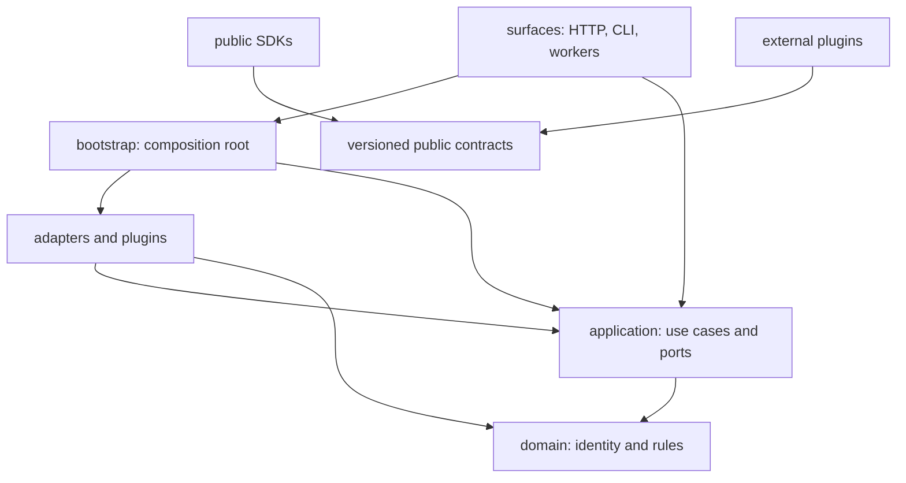

# Repository structure and dependency rules

**Status:** Accepted foundation  
**Date:** 2026-08-14

The code begins as a modular monolith with ports and adapters. Dependency direction is the primary guard against a future distributed monolith.



## Rules

| Layer | Owns | May depend on | Must not depend on |
| --- | --- | --- | --- |
| `domain` | Identity, immutable concepts, pure rules | Python standard library | Application, adapters, surfaces, vendor SDKs |
| `application` | Use cases and provider-neutral ports | Domain | Concrete adapters, surfaces, vendor SDKs |
| `adapters` | Persistence, buses, models, policies, providers | Application, domain | Surfaces |
| `surfaces` | HTTP/CLI/message protocols and presentation | Application; bootstrap for composition | Vendor logic and domain policy branches |
| `bootstrap` | Concrete dependency graph and runtime profiles | All server layers | Business rules |
| `sdks` | Public client types, transport, errors | Public contracts | Server internals |
| `plugins` | Separately versioned extension behavior | Plugin protocol and public contracts | Server internals or ambient process state |

The reference code under `src/iip` proves these directions. Future languages or services keep the same ownership even when process boundaries change. `src/iip/surfaces/worker.py` is the deployable workflow-worker surface: investigation claim/retry/cancellation, non-replaying action reconciliation, freshness sampling, bounded evidence artifact retention, and outbox delivery stay in `application`; PostgreSQL lease/retention mechanics and event transports stay in `adapters`; concrete construction stays in `bootstrap.py`. Deployment telemetry follows the same rule: heartbeat, freshness, and SLO interpretation are application use cases; the failure-isolated timer, bounded counter-sample aggregation, and shared-store persistence are adapters; and only the composition root starts their lifecycle. Executable capacity, recovery, deployment-preflight, post-install diagnostics, GitHub-context compatibility, external-ingress certification, explicit customer control-plane continuity qualification, exact customer deployment evidence aggregation, bounded external control-plane read-load qualification, multi-node planned-disruption qualification, exact release-signature qualification, SBOM vulnerability qualification, aggregate release-readiness verification, and fail-closed composition of the local release gates remain operational harnesses under `scripts/`; they invoke public application/adapter, sanitized Helm, closed HTTP, Kubernetes, or verified release-artifact boundaries and emit contracts, but they are not serving use cases or ambient production workloads. The customer continuity harness composes the read-only external probe with one separately enabled, UID-preconditioned `policy/v1` Eviction; it never moves that mutation authority into the API, worker, SDK, or plugin runtime. The additive customer deployment harness only revalidates and joins owning reports, protected values, exact target hashes, and the current namespace UID/server binding; it has no mutation or production-approval authority. The load harness is a separately enabled external client with a bounded fixed-rate schedule and read-only credential; it never becomes an API, worker, agent, or plugin capability.

The Kubernetes integration under `plugins/examples/` is the first executable proof of the plugin boundary. It imports only the public Python SDK, consumes versioned resource collection, invocation, mediation, and compatibility-report contracts, supports an offline stdio observer plus an explicit bounded `kubectl` per-type list/watch development transport with full-reconciliation recovery, and exposes a proposal-only action-provider conformance method. Separately signed offline, mediated-read, and mediated-action manifests pass in the no-network Docker matrix. The action path routes an allowed plugin request into the existing governed action service and proves the result stops pending independent approval without exposing execution or credentials. The runner and HTTPS mediation gateway are concrete adapters; their application-owned ledger, binding, policy, audit, credential, action-proposal, and gateway ports keep authority out of the plugin and domain. Lifecycle status, cancellation, and post-deadline reconciliation stay in the application boundary. The repository validator applies the same no-server-internals rule to all Python plugin packages.

Customer OIDC prerequisite qualification follows the operational-harness
boundary: `scripts/qualify_customer_oidc.py` consumes protected host-side
identity configuration and a short-lived credential, observes the issuer and
deployed public HTTP contracts, and emits a minimized report. It is not a
serving identity flow, SDK authenticator, adapter, or plugin capability.

Customer policy qualification follows the same boundary:
`scripts/qualify_customer_policy.py` consumes a protected reviewed case profile
and separate credential/CA files, calls the existing production policy adapter,
and emits only source/image identities, digests, counts, timing, stable checks,
and explicit limitations. It neither reads nor manages the customer bundle,
and it grants no runtime authority. The customer deployment harness rebinds
that minimized report without receiving the policy credential.

Customer credential-broker qualification is also host-side:
`scripts/qualify_customer_credential_broker.py` consumes a mode-`0600`
authority profile and workload-token file plus a selected CA, then invokes the
production external broker adapter. It retains no authority tuple, workload
identity, or issued lease. The deployment aggregate rebinds its minimized
report, profile, endpoint, and CA without calling the broker.

Customer OTLP receiver qualification remains an operational harness as well:
`scripts/qualify_customer_otlp_receiver.py` runs a digest-pinned official
Collector outside the serving workloads, delivers three bounded synthetic
signals through customer mTLS and channel authentication, and reads only the
Collector's exporter self-metrics to establish downstream delivery. Its
protected inputs and ephemeral queue do not enter the API, SDK transport,
plugin runtime, or customer deployment aggregate; the aggregate rebinds only
the minimized report, profile, public targets, trust files, and certificate.

The private `src/iip/surfaces/worker_health.py` listener consumes only the
application-owned readiness port. It exposes no control-plane use case,
identity, tenant data, or provider detail.

## Placement decisions

- A provider-specific API call belongs in `adapters/<provider>` or a plugin.
- A capability selected by an agent is a tool contract; the implementation delegates to a provider port.
- A use-case sequence belongs in `application`, not an HTTP handler or queue consumer.
- Shared data crossing a process boundary belongs in `contracts`, not a copied internal class.
- A derived read model belongs in an adapter and is rebuildable from domain records.
- A component that needs both plugin discovery and a use case is wired in `bootstrap`.

## Planned top-level expansion

Add directories only with an executable slice:

```text
apps/                 independently deployable surfaces/workers
packages/             shared implementation packages after language expansion
evaluations/          incident scenarios, expected evidence, scoring
deploy/operators/     collectors or operators deployed into target environments
```

Do not create empty service forests. The roadmap defines when a process boundary becomes necessary.
