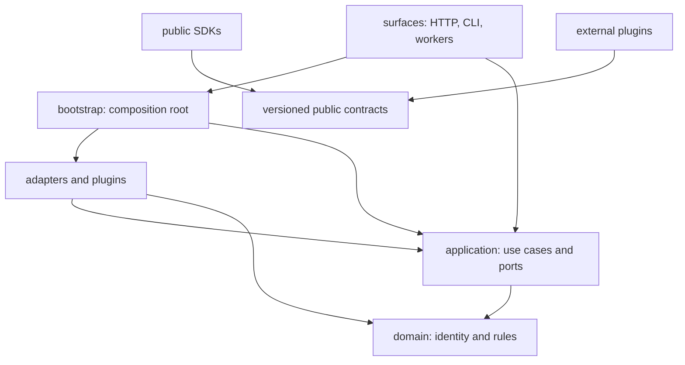

# Repository structure and dependency rules

**Status:** Accepted foundation  
**Date:** 2026-08-14

The code begins as a modular monolith with ports and adapters. Dependency direction is the primary guard against a future distributed monolith.



## Rules

| Layer | Owns | May depend on | Must not depend on |
| --- | --- | --- | --- |
| `domain` | Identity, immutable concepts, pure rules | Python standard library | Application, adapters, surfaces, vendor SDKs |
| `application` | Use cases and provider-neutral ports | Domain | Concrete adapters, surfaces, vendor SDKs |
| `adapters` | Persistence, buses, models, policies, providers | Application, domain | Surfaces |
| `surfaces` | HTTP/CLI/message protocols and presentation | Application; bootstrap for composition | Vendor logic and domain policy branches |
| `bootstrap` | Concrete dependency graph and runtime profiles | All server layers | Business rules |
| `sdks` | Public client types, transport, errors | Public contracts | Server internals |
| `plugins` | Separately versioned extension behavior | Plugin protocol and public contracts | Server internals or ambient process state |

The reference code under `src/iip` proves these directions. Future languages or services keep the same ownership even when process boundaries change. `src/iip/surfaces/worker.py` is the deployable workflow-worker surface: investigation claim/retry/cancellation, non-replaying action reconciliation, freshness sampling, bounded evidence artifact retention, and outbox delivery stay in `application`; PostgreSQL lease/retention mechanics and event transports stay in `adapters`; concrete construction stays in `bootstrap.py`. Deployment telemetry reporting follows the same rule: the heartbeat and query semantics are application use cases, the failure-isolated timer and shared-store persistence are adapters, and only the composition root starts their lifecycle.

The Kubernetes integration under `plugins/examples/` is the first executable proof of the plugin boundary. It imports only the public Python SDK, consumes versioned resource collection, invocation, mediation, and compatibility-report contracts, supports an offline stdio observer plus an explicit bounded `kubectl` per-type list/watch development transport with full-reconciliation recovery, and exposes a proposal-only action-provider conformance method. Separately signed offline, mediated-read, and mediated-action manifests pass in the no-network Docker matrix. The action path routes an allowed plugin request into the existing governed action service and proves the result stops pending independent approval without exposing execution or credentials. The runner and HTTPS mediation gateway are concrete adapters; their application-owned ledger, binding, policy, audit, credential, action-proposal, and gateway ports keep authority out of the plugin and domain. Lifecycle status, cancellation, and post-deadline reconciliation stay in the application boundary. The repository validator applies the same no-server-internals rule to all Python plugin packages.

## Placement decisions

- A provider-specific API call belongs in `adapters/<provider>` or a plugin.
- A capability selected by an agent is a tool contract; the implementation delegates to a provider port.
- A use-case sequence belongs in `application`, not an HTTP handler or queue consumer.
- Shared data crossing a process boundary belongs in `contracts`, not a copied internal class.
- A derived read model belongs in an adapter and is rebuildable from domain records.
- A component that needs both plugin discovery and a use case is wired in `bootstrap`.

## Planned top-level expansion

Add directories only with an executable slice:

```text
apps/                 independently deployable surfaces/workers
packages/             shared implementation packages after language expansion
evaluations/          incident scenarios, expected evidence, scoring
deploy/operators/     collectors or operators deployed into target environments
```

Do not create empty service forests. The roadmap defines when a process boundary becomes necessary.
