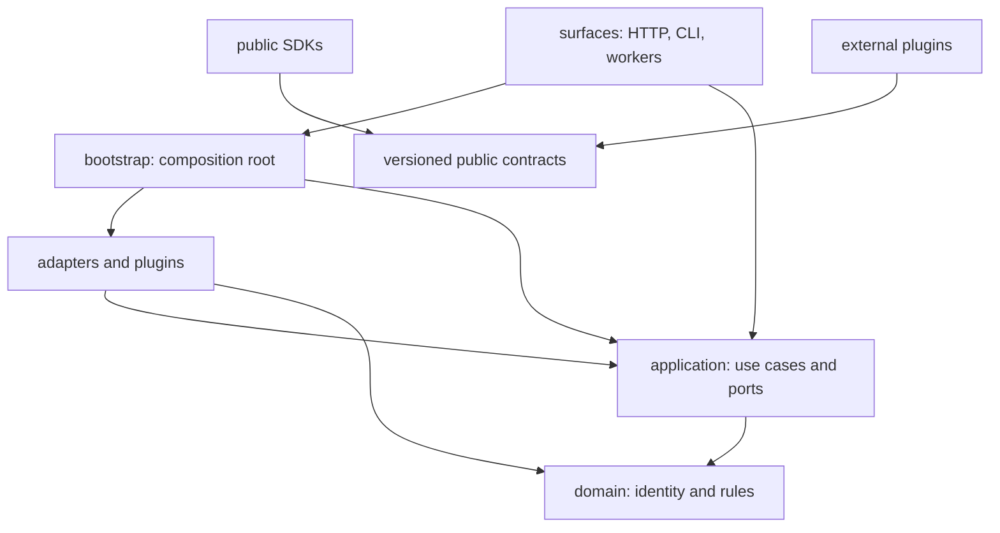

# Repository structure and dependency rules

**Status:** Accepted foundation  
**Date:** 2026-08-14

The code begins as a modular monolith with ports and adapters. Dependency direction is the primary guard against a future distributed monolith.



## Rules

| Layer | Owns | May depend on | Must not depend on |
| --- | --- | --- | --- |
| `domain` | Identity, immutable concepts, pure rules | Python standard library | Application, adapters, surfaces, vendor SDKs |
| `application` | Use cases and provider-neutral ports | Domain | Concrete adapters, surfaces, vendor SDKs |
| `adapters` | Persistence, buses, models, policies, providers | Application, domain | Surfaces |
| `surfaces` | HTTP/CLI/message protocols and presentation | Application; bootstrap for composition | Vendor logic and domain policy branches |
| `bootstrap` | Concrete dependency graph and runtime profiles | All server layers | Business rules |
| `sdks` | Public client types, transport, errors | Public contracts | Server internals |
| `plugins` | Separately versioned extension behavior | Plugin protocol and public contracts | Server internals or ambient process state |

The reference code under `src/iip` proves these directions. Future languages or services keep the same ownership even when process boundaries change. `src/iip/surfaces/worker.py` is the deployable workflow-worker surface: investigation claim/retry/cancellation, non-replaying action reconciliation, freshness sampling, bounded evidence artifact retention, and outbox delivery stay in `application`; PostgreSQL lease/retention mechanics and event transports stay in `adapters`; concrete construction stays in `bootstrap.py`. Deployment telemetry follows the same rule: heartbeat, freshness, and SLO interpretation are application use cases; the failure-isolated timer, bounded counter-sample aggregation, and shared-store persistence are adapters; and only the composition root starts their lifecycle. Executable capacity, recovery, deployment-preflight, post-install diagnostics, GitHub-context compatibility, external-ingress certification, explicit customer control-plane continuity qualification, exact customer deployment evidence aggregation, bounded external control-plane read-load and sustained core-workload qualification, multi-node planned-disruption qualification, complete local AI FinOps runtime and standalone sustained-load qualification, exact release-signature qualification, SBOM vulnerability qualification, aggregate release-readiness verification, and fail-closed composition of the local release gates remain operational harnesses under `scripts/`; they invoke public application/adapter, sanitized Helm, closed HTTP, Kubernetes, Docker, or verified release-artifact boundaries and emit contracts, but they are not serving use cases or ambient production workloads. The AI FinOps harnesses compose fixture spans with replaceable Collector, receiver, storage, telemetry, and dashboard boundaries, then emit only minimized source-bound evidence; neither enters inference paths nor upgrades fixtures into customer/provider claims. The sustained-load harness additionally owns its bounded fixed-rate schedule and remains outside `make verify`, the one-command local release qualifier, and release readiness until cross-architecture calibration is accepted. The customer continuity harness composes the read-only external probe with one separately enabled, UID-preconditioned `policy/v1` Eviction; it never moves that mutation authority into the API, worker, SDK, or plugin runtime. The additive customer deployment harness only revalidates and joins owning reports, protected values, exact target hashes, and the current namespace UID/server binding; it has no mutation or production-approval authority. The external control-plane load harness is a separately enabled client with a bounded fixed-rate schedule and read-only credential; it never becomes an API, worker, agent, or plugin capability.

PostgreSQL transport policy remains adapter-owned. The connection-security
module validates protected environment configuration and supplies the effective
libpq arguments to the resource, operations, and readiness adapters; only
`bootstrap.py` selects that configuration for API, worker, receiver, and
maintenance composition. Helm supplies the same declared mode and trust path
to each packaged process, while its backup wrapper applies the equivalent rule
to the separate libpq utility image. No application or domain package parses a
database URL or decides transport security.

The Kubernetes integration under `plugins/examples/` is the first executable proof of the plugin boundary. It imports only the public Python SDK, consumes versioned resource collection, invocation, mediation, and compatibility-report contracts, supports an offline stdio observer plus an explicit bounded `kubectl` per-type list/watch development transport with full-reconciliation recovery, and exposes a proposal-only action-provider conformance method. Separately signed offline, mediated-read, and mediated-action manifests pass in the no-network Docker matrix. The action path routes an allowed plugin request into the existing governed action service and proves the result stops pending independent approval without exposing execution or credentials. The runner and HTTPS mediation gateway are concrete adapters; their application-owned ledger, binding, policy, audit, credential, action-proposal, and gateway ports keep authority out of the plugin and domain. Lifecycle status, cancellation, and post-deadline reconciliation stay in the application boundary. The repository validator applies the same no-server-internals rule to all Python plugin packages.

Customer OIDC prerequisite qualification follows the operational-harness
boundary: `scripts/qualify_customer_oidc.py` consumes protected host-side
identity configuration and a short-lived credential, observes the issuer and
deployed public HTTP contracts, and emits a minimized report. It is not a
serving identity flow, SDK authenticator, adapter, or plugin capability.

Customer policy qualification follows the same boundary:
`scripts/qualify_customer_policy.py` consumes a protected reviewed case profile
and separate credential/CA files, calls the existing production policy adapter,
and emits only source/image identities, digests, counts, timing, stable checks,
and explicit limitations. It neither reads nor manages the customer bundle,
and it grants no runtime authority. The customer deployment harness rebinds
that minimized report without receiving the policy credential.

Customer credential-broker qualification is also host-side:
`scripts/qualify_customer_credential_broker.py` consumes a mode-`0600`
authority profile and workload-token file plus a selected CA, then invokes the
production external broker adapter. It retains no authority tuple, workload
identity, or issued lease. The deployment aggregate rebinds its minimized
report, profile, endpoint, and CA without calling the broker.

Customer GitHub context qualification composes, but does not merge, those
boundaries. `scripts/qualify_customer_github_context.py` first verifies one
exact GitHub authority report from the customer broker qualifier, then invokes
the existing `GithubContextDocumentsBackend` for one immutable document. It
retains only source/image identity, counts, latency, digests, stable checks,
and fixed limitations. The customer profile, integration snapshot, endpoint,
repository identity, revision, credential, and content do not enter the SDK
transport or report, and the optional report is not a generic deployment
requirement.

Customer Bedrock qualification remains outside the serving and inference
paths. `scripts/qualify_customer_bedrock.py` validates one protected reviewed
target and one dedicated temporary-credential file, invokes the isolated
pinned official-instrumentation container plus the separately packaged
`instrumentation/python/aws-bedrock` usage adapter, and emits a protected
detailed compatibility report plus a transportable minimized report. The
adapter belongs in the customer's instrumented application environment and
has no dependency on IIP server or SDK packages. No provider SDK or credential
enters `domain`, `application`, the product image, public SDK transport, agent
runtime, or plugin runtime.

Customer OTLP receiver qualification remains an operational harness as well:
`scripts/qualify_customer_otlp_receiver.py` runs a digest-pinned official
Collector outside the serving workloads, delivers three bounded synthetic
signals through customer mTLS and channel authentication, and reads only the
Collector's exporter self-metrics to establish downstream delivery. Its
protected inputs and ephemeral queue do not enter the API, SDK transport,
plugin runtime, or customer deployment aggregate; the aggregate rebinds only
the minimized report, profile, public targets, trust files, and certificate.

Customer AI FinOps prerequisite aggregation is another host-side harness.
`scripts/qualify_customer_ai_finops.py` reads six independently owned reports
and one protected reviewed profile, revalidates their schemas, freshness,
release identities, and nested report digests, and emits a minimized aggregate.
It calls no provider, Collector, deployment, ledger, or dashboard and therefore
cannot be a serving use case or end-to-end qualification. The public SDKs expose
only its offline envelope types.

Customer AI FinOps same-invocation qualification remains host-side as well.
`scripts/qualify_customer_ai_finops_flow.py` composes the pinned Bedrock
compatibility harness, existing privileged observation use case, and direct
Prometheus/Grafana reads. It retains trace/span and customer attribution only in
owner-only temporary evidence and exports a minimized digest-bound report. It
does not enter the serving process, inference request path, SDK transport,
agent runtime, or plugin authority boundary.

Local AI FinOps sustained-load qualification is a separate host-side harness.
`scripts/qualify_ai_finops_sustained_load.py` validates one content-addressed
synthetic profile, drives only the disposable Docker topology, and emits a
source-bound aggregate report. Original traffic crosses the Collector; a
separately paced replay uses the direct receiver channel only after exact
original durability so its acknowledgement is commit-bound. The shell runner
supplies loopback endpoints, inspects the running application and Collector
images, and installs exact ephemeral fixture policy/catalog generations.
Database joins remain run-prefix and engine-generation scoped, and a separate
exclusion count detects concurrent durable local traffic. Neither the profile
nor report carries a tenant, provider account, model, endpoint, credential,
token, policy/catalog source hash, price, amount, trace, or content value. The
public SDKs expose its offline envelopes only; they cannot start traffic or turn
the single-host observation into customer or release authority.

Customer pilot readiness is an additive host-side promotion preflight.
`scripts/assess_customer_pilot_readiness.py` revalidates and cross-binds the
existing publication, organizational signature, local readiness, customer
deployment, bounded read load, sustained core-workload, customer-approved
planned-failure overlap, AI prerequisite, same-invocation, and customer
operational-alert reports. Its v2 aggregate additionally binds the exact
namespace, `ai-finops-v0` alert profile, canonical alert binding set, and
same-invocation Prometheus target and requires alert observation after
deployment qualification. It does not repeat their external actions or import
signing, registry, customer, provider, load-generation, installation,
monitoring-mutation, or pilot authority. Only the protected profile and
minimized report shapes enter the public SDK boundary.

Customer operational-alert qualification is a separate read-only host-side
harness. `scripts/qualify_customer_operational_alerts.py` reads bounded
CA-verified Prometheus, Alertmanager, and customer receipt APIs with three
distinct credentials, then emits aggregate-only evidence for loaded rules,
component heartbeats, and one synthetic firing/recovery route. It does not
install rules, post or silence alerts, change routes, stop a component, contact
a person, or enter an API, worker, agent, plugin, or SDK authority path.

Customer sustained-workload qualification remains a separate host-side
operational harness. `scripts/qualify_customer_sustained_workload.py` reuses
the processing-continuity client's exact-release HTTPS read, mTLS OTLP metric,
and durable-investigation boundaries under two bounded fixed-rate schedules.
It receives protected targets and credentials only at execution time, skips
late slots instead of bursting, and emits only aggregate counts, percentiles,
checks, limitations, and pseudonymous bindings. It is not an API, background
service, SDK traffic method, agent tool, plugin capability, or claim that the
synthetic mix represents customer traffic.

Customer failure-overlap qualification is a traffic-free host-side evidence
join. `scripts/assess_customer_failure_overlap.py` revalidates the exact
deployment, sustained workload, API continuity, worker/receiver continuity,
and PostgreSQL promotion reports, then proves the three planned-disruption
windows fit within one customer-approved private-pilot core proxy. It receives
no traffic credential or disruption authority, retains only minimized
pseudonymous evidence, and exposes only offline profile/report shapes to SDKs.

Private-pilot onboarding remains documentation and release packaging, not a
serving package. `scripts/release_bundle.py` treats the exact-version operating
handoff as an inspected, checksum-bound artifact and rejects unsafe or
incomplete archive structure. Customer contacts, support/security channels,
response objectives, protected profiles, feedback records, and live evidence
remain outside source control and the portable bundle.

Persistent community installation packaging is also operational tooling.
`scripts/installation_kit.py` reads committed source objects, builds a bounded
versioned archive and inspects it without extracting or executing its code.
The release manifest binds this kit alongside the runtime images. Packaging
imports no Docker, provider or serving authority, and the extracted installer
continues to compose the existing public configuration boundaries.
`scripts/package_licensed_chart.py` similarly packages the committed chart with
the same revision's license notices without changing chart behavior.

Release checkpoint transport remains outside server and SDK packages.
`scripts/release_stage.py` seals and restores the bounded archive using trusted
job-output hashes. `scripts/verify_release_stage_evidence.py` joins existing
publication, signature and vulnerability contracts to the same bundle and
rechecks freshness before publication. Neither helper grants signing or
registry authority; that remains scoped to protected workflow jobs.

`scripts/community_images.py` is likewise host-side operational tooling. It
resolves an explicitly selected set of five registry digests to native Linux
image IDs on the already-bound local Docker daemon. Optional downloads receive
only the operator's Docker CLI environment, never installation credentials.
Startup uses that mapping only within its installation lock; no image-presence
receipt, serving API, SDK capability or signature authority is introduced.

Exact AI invocation observation follows the normal serving boundaries.
`src/iip/application/query_ai_invocation.py` owns authorization, active-source
selection, privacy minimization, and record revalidation; the in-memory and
PostgreSQL adapters own exact tenant lookup; the HTTP surface owns only the
closed POST protocol. The optional Bedrock OTLP delivery hook remains in its
isolated provider-compatibility harness. Its owner-only trace/span artifact is
operational input, never an SDK authority or a dashboard dimension.

The private `src/iip/surfaces/worker_health.py` listener consumes only the
application-owned readiness port. It exposes no control-plane use case,
identity, tenant data, or provider detail.

## Placement decisions

AI history availability follows the same serving dependency direction:
`application/query_ai_history.py` owns tenant authorization, interval validation,
and aggregate report semantics. Application-owned ports express the read-only
availability state and retired-history failure; adapters own marker lookup and
consistent snapshots around guarded allocation, invocation, and savings reads.
The HTTP surface maps retired history to the stable protocol error, and SDKs
consume only the public report. No deletion policy, production marker writer,
or operational filesystem authority is introduced into these boundaries.

Delivered-outbox retention follows normal serving boundaries:
`application/event_outbox_retention.py` owns authorization, policy binding, and
aggregate report semantics; the resource adapters own terminal-row selection,
tenant serialization, and atomic deletion/audit; the HTTP surface observes only
and the worker schedules explicit tenant batches. Only bootstrap selects the
configured policy. Public SDKs consume the report and cannot execute cleanup.

The community installation helpers under `scripts/community_*.py` are
operational composition tooling. They validate existing public configuration
through the owning application/adapter boundaries, generate protected local
transport/configuration files, and invoke Docker Compose. They do not add
domain/application dependencies, import provider SDKs, grant inference access,
or become a new customer SDK. Generated Collector and Grafana configuration
remain replaceable deployment assets under `deploy/community` and
`deploy/grafana`; no authoritative ledger moves into those backends.

Community recovery follows the same operational boundary.
`scripts/community_recovery.py` owns offline orchestration, exact image and
daemon/volume binding, whole-installation manifest validation, fresh target
reservation, and startup fencing. `scripts/community_backup_crypto.py` owns
bounded authenticated encryption and protected no-overwrite publication;
`deploy/community/recovery_volume.py` is the networkless strict volume
transport. Their internal archive format is not a public resource contract or
an SDK capability. No recovery file access, Docker authority, key custody, or
archive parsing enters the server domain/application packages. The separately
invoked Docker test remains an owned operational experiment, not a customer
recovery guarantee.

`scripts/community_trust.py` similarly owns only host-side transport lifecycle:
immutable CA/leaf generations, an atomic protected selection pointer,
stopped-stack transition checks, public overlap material, and receipt-bound
finalization. The installer projects the selected generation; ordinary serving
packages continue consuming their existing verified-TLS paths. The lifecycle
does not change public API/SDK contracts, create a hosted CA, modify external
exporters, or move Docker/filesystem authority into domain or application code.

- A provider-specific API call belongs in `adapters/<provider>` or a plugin.
- A capability selected by an agent is a tool contract; the implementation delegates to a provider port.
- A use-case sequence belongs in `application`, not an HTTP handler or queue consumer.
- Shared data crossing a process boundary belongs in `contracts`, not a copied internal class.
- Provider-specific telemetry enrichment that must run beside a customer library belongs in `instrumentation/<language>/<provider>`, not the public SDK or server kernel.
- A derived read model belongs in an adapter and is rebuildable from domain records.
- A component that needs both plugin discovery and a use case is wired in `bootstrap`.

## Planned top-level expansion

Add directories only with an executable slice:

```text
apps/                 independently deployable surfaces/workers
packages/             shared implementation packages after language expansion
evaluations/          incident scenarios, expected evidence, scoring
deploy/operators/     collectors or operators deployed into target environments
```

Do not create empty service forests. The roadmap defines when a process boundary becomes necessary.
